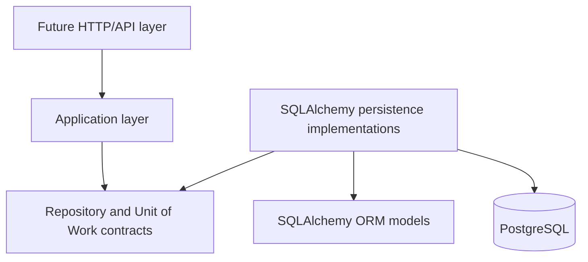

# Application Core and Persistence Architecture

## Goals

Stage `03.0.1` establishes the boundary rules for the future application core and PostgreSQL persistence layer. It defines dependency direction, package responsibilities, repository contract conventions, Unit of Work semantics, transaction ownership, tenant-safety rules, ORM entity usage policy, persistence error boundaries, relationship-loading conventions, write/read separation, testing expectations, and the implementation order for `03.0.2+`.

## Non-goals

This stage does not implement concrete repositories, a SQLAlchemy Unit of Work, API routes, FastAPI dependency wiring, Pydantic request or response schemas, lifecycle services, temporal replacement workflows, merge workflows, collectors, background jobs, event buses, partitioning, sharding, async SQLAlchemy, or new database tables. Existing merged Alembic migrations are not edited.

## Current-State Assessment

The current repository uses synchronous SQLAlchemy. `api/app/db/session.py` creates a synchronous engine with `create_engine(...)`, centralizes `SessionLocal` through `create_session_factory(..., expire_on_commit=False)`, exposes `get_session()`, and provides a small `transaction_session()` context manager that commits on successful exit and rolls back on exceptions.

Database settings are loaded through `DatabaseSettings` in `api/app/db/settings.py`. Alembic imports `app.models` in `api/alembic/env.py`, which registers all SQLAlchemy mapped models against `Base.metadata`. Tests create isolated PostgreSQL databases in `api/tests/conftest.py`, run Alembic to `head`, create synchronous sessions with `sessionmaker`, and roll back fixture sessions after use.

There is no existing application-service package, repository abstraction, Unit of Work abstraction, DTO hierarchy, or dependency-injection wiring. The repository should therefore preserve the current synchronous SQLAlchemy model and introduce only the minimum application-facing contracts needed to make the next stage explicit and testable.

## Dependency Direction



The application layer owns use-case decisions and depends on application-facing contracts. SQLAlchemy implementations adapt those contracts to ORM models and PostgreSQL.

## Dependency Matrix

| Source | May depend on | Must not depend on |
| --- | --- | --- |
| Future API layer | Application use cases, application errors, DTOs when introduced | SQLAlchemy sessions for write operations, concrete repositories |
| Application layer | ORM mapped entity types, application ports, application errors | SQLAlchemy `Session`, query APIs, driver exceptions, concrete persistence implementations |
| Application ports | Standard library typing and domain/entity types | SQLAlchemy, FastAPI, Pydantic, concrete persistence implementations |
| SQLAlchemy persistence | Application ports, application errors, ORM models, SQLAlchemy | API routing, business workflows outside persistence adaptation |
| ORM models | SQLAlchemy base/mixins and model relationships | Application services, repositories, API handlers |
| Infrastructure wiring | Application use cases and concrete implementations | Business logic |

## Package and Module Boundaries

The minimum package baseline is:

```text
api/app/application/
  errors.py
  ports/
    catalogs.py
    labels.py
    lineage.py
    organizations.py
    repositories.py
    resources.py
    temporal.py
    tenants.py
    unit_of_work.py
api/app/persistence/
  sqlalchemy/
    repositories/
```

`app.application` is the application core boundary. It contains application-facing errors and ports and must not import SQLAlchemy. `app.persistence.sqlalchemy` is the adapter location for SQLAlchemy persistence code. The concrete synchronous Unit of Work lives in `app.persistence.sqlalchemy.unit_of_work.SQLAlchemyUnitOfWork`; future concrete repositories will live under the same persistence boundary.

Shared SQLAlchemy repository infrastructure now lives in `app.persistence.sqlalchemy.repositories`. It is an internal adapter utility package, not an application-facing contract package. `base.py` contains the session-bound base repository and direct binding helper, `tenant_scoped.py` contains tenant-owned repository primitives, and `helpers.py` contains small typed statement helpers for entity lookup, tenant-scoped lookup, explicit loader options, and opt-in `SELECT ... FOR UPDATE`.

## Repository Contract Conventions

Repository contracts are synchronous protocols. Tenant-owned repository methods require an explicit `tenant_id`; normal operational methods must not accept `tenant_id: UUID | None = None` or infer tenant scope implicitly. Lookup methods return `Entity | None` for not-found and cross-tenant misses so callers do not learn whether an entity exists in another tenant.

Repository contracts express domain-oriented operations. They must not expose SQLAlchemy `Session`, `Select`, `Query`, `Row`, driver exceptions, FastAPI types, Pydantic types, unrestricted public CRUD, or generic `filter(**kwargs)` APIs. Repositories do not call `commit()`. Complex read projections, search, history views, and pagination may later be implemented through query services rather than generic repositories.

Global managed catalogs remain global. They use separate explicit contracts and must not be forced into tenant-owned repository conventions.

The Resource Inventory repository inventory is:

| Repository | Tenant scoped | Primary responsibility | Mutation support |
| --- | --- | --- | --- |
| `TenantRepository` | No | Tenant lookup and creation by id or slug | `add` |
| `OrganizationRepository` | Yes | Organization access by id, canonical name, external key, and direct children | `add` |
| `ResourceRepository` | Yes | Resource aggregate access by id, canonical name, and explicit lock-oriented lookup | `add` |
| `LabelRepository` | Yes | Tenant label lookup by id or key/value and active-label listing | `add` |
| `ManagedCatalogRepository` | No | Global catalog lookup by id/code and active listing | Read-only |
| `ClassificationValueRepository` | No | Classification values scoped by classification type | Read-only |
| `ResourceIdentifierRepository` | Yes | Current identifier lookup by resource or normalized value | `add` |
| `ResourceOwnershipRepository` | Yes | Current ownership and current-primary ownership lookup | `add` |
| `ResourceRelationshipRepository` | Yes | Current incoming/outgoing resource relationships | `add` |
| `ResourceClassificationRepository` | Yes | Current classifications and current-primary classification lookup | `add` |
| `ResourceLabelRepository` | Yes | Current resource label assignments | `add` |
| `ResourceStateRepository` | Yes | Current state and state history access | `add` |
| `ResourceAliasRepository` | Yes | Alias-to-resource lookup and resource alias listing | `add` |
| `ResourceMergeRepository` | Yes | Outgoing and incoming merge lineage persistence | `add` |

Singular lookups return `Entity | None`. Collection methods return `Sequence[Entity]`. Existence methods return `bool`. Mutation methods return `None` and only attach rows to the active Unit of Work; they do not commit, roll back, open sessions, or own transaction lifecycle.

Tenant is the scope root, so `TenantRepository` does not require a separate tenant context. Tenant-owned repositories require explicit `tenant_id` for all read/access methods. `add(entity)` methods rely on the entity's own tenant fields and still run inside the caller's Unit of Work. Cross-tenant misses must remain indistinguishable from ordinary not-found results.

Global managed catalog repositories deliberately do not accept `tenant_id`; `resource_type`, `identifier_type`, `relationship_type`, `ownership_role`, `classification_type`, `classification_value`, `lifecycle_status`, `criticality`, and `exposure_level` remain global managed catalogs.

The resource aggregate contract includes `get_for_update(...)` to reserve a place for explicit concurrent mutation workflows. It does not expose SQLAlchemy lock expressions. Identifier-based resource matching belongs to `ResourceIdentifierRepository`; canonical merge traversal belongs to later merge/query service work and is not exposed on `ResourceRepository` in this stage.

Temporal fact repositories expose current/history lookup boundaries and `add(...)` only. They do not expose `close_current(...)`, `replace_current(...)`, or a universal temporal repository framework because temporal replacement semantics belong to later application-service issues.

Alias and merge contracts expose alias resolution and merge-lineage persistence only. They do not implement merge execution, canonical traversal, alias transfer, deduplication, or conflict-resolution workflows.

Repository contracts are defined independently from the application-facing Unit of Work. The Unit of Work protocol is not expanded with repository properties in this stage, because doing so would force the concrete SQLAlchemy Unit of Work to expose repository implementations before those implementations exist. Future SQLAlchemy repository implementation issues will attach concrete repositories to the Unit of Work while preserving this contract boundary.

The shared SQLAlchemy base repository exposes only internal primitives: attach an entity to the injected session, explicitly flush pending work, explicitly refresh an entity, evaluate prepared scalar or sequence statements, and test existence through a prepared statement. It deliberately does not expose a public generic CRUD interface, unrestricted `filter(**kwargs)`, generic query execution, destructive delete helpers, transaction control, or domain-specific lookups. Concrete repositories in `03.0.5+` remain responsible for methods such as `get_by_slug`, `get_by_canonical_name`, current temporal lookups, lineage lookups, and use-case-specific loading choices.

## Unit of Work Semantics

The application-facing Unit of Work supports:

```python
with unit_of_work:
    # access repositories and perform mutations
    unit_of_work.commit()
```

Entering the context opens one session and transaction. Multiple repositories exposed by the Unit of Work share that same session and transaction. `commit()` is explicit and owned by the Unit of Work. `rollback()` is explicit and may be called by the application when needed.

On exception, the Unit of Work rolls back and closes the session. When the context exits without an explicit successful commit, it also rolls back and closes the session. After a failed flush or commit, the Unit of Work is considered failed; callers should roll back, exit the context, and start a new Unit of Work. Repository instances are scoped to one Unit of Work lifetime and must not be reused after the Unit of Work closes.

The concrete SQLAlchemy implementation is single-use and follows explicit lifecycle states: `new`, `active`, `committed`, `rolled_back`, `failed`, and `closed`. It rejects commit, rollback, or session access before `__enter__`; rejects entering an already active instance; rejects reuse after closure; rejects a second commit; rejects rollback after commit; and rejects commit after rollback or failed transaction. Cleanup rollback is safe and repeated explicit rollback is idempotent while the Unit of Work is still open.

The concrete `session` property is infrastructure-facing and available only while the Unit of Work is active. It is not part of the application-facing `UnitOfWork` protocol. Future SQLAlchemy repositories attached to one Unit of Work must receive this exact session instance and must never call `commit()`.

`SQLAlchemyUnitOfWork` accepts an injectable synchronous session factory. Production wiring uses the shared `SessionLocal` configured from the application engine. Tests inject their own isolated `sessionmaker` bound to the test engine. A Unit of Work creates exactly one session from the factory, closes that session on exit, and does not dispose the shared engine.

SQLAlchemy repositories are constructed with the active Unit of Work session through direct constructor injection or the small internal `bind_repository(...)` helper. They do not create sessions, engines, nested transactions, or repository-owned transaction boundaries. Multiple repositories created inside one Unit of Work share the same session instance. Repository instances are scoped to that Unit of Work lifetime and are not safe to reuse after the Unit of Work closes.

## Transaction Ownership

One application command or use case normally owns one Unit of Work. Application services decide whether the operation succeeds. Repositories never commit and helper functions must not hide commits. External network calls should not normally run inside an open database transaction.

Repository `add(...)`, lookup helpers, refresh helpers, and locking helpers never commit, roll back, close a session, dispose an engine, retry a failed transaction, or translate SQLAlchemy/database exceptions. A failed flush remains the Unit of Work's failed transaction; cleanup is handled by `SQLAlchemyUnitOfWork` rollback-on-exit or an explicit Unit of Work rollback. Repositories may flush only when the concrete operation requires generated/default values, early constraint validation, or subsequent dependent writes, and no helper commits after flushing.

Read-only query services may later use a separate controlled session pattern. SQLAlchemy and PostgreSQL errors are translated at the persistence boundary. Retry behavior for deadlocks or serialization failures must be explicit at the application orchestration level and must not be hidden inside repositories.

The existing `get_session()` helper remains available for lower-level framework integration. The existing `transaction_session()` helper remains for current low-level scripts or compatibility paths, but it is not the application-core transaction abstraction. New application command workflows should use `SQLAlchemyUnitOfWork`.

## Tenant-Safety Rules

Tenant-owned repository methods require explicit tenant context. Lookups by entity id alone are prohibited for tenant-owned entities. There is no optional, ambient, or implicit tenant scope for normal application operations.

SQLAlchemy implementations must apply tenant predicates even when PostgreSQL composite foreign keys also enforce integrity. Cross-tenant misses return the same application-facing result as absent rows. Future global administrative access must use separate explicit contracts. Every future concrete repository issue must include tenant-isolation tests.

Tenant-scoped repository infrastructure requires explicit `tenant_id` for tenant-owned statement construction and entity lookup. The shared `tenant_select(...)` and `tenant_entity_select(...)` helpers centralize the tenant predicate; tenant-owned id lookup always includes both `tenant_id` and entity `id`. There is no `tenant_id=None` default, no ambient tenant scope, no `ignore_tenant` bypass flag, and no unscoped fallback helper on the tenant-scoped base. Global catalog repositories use the plain base repository and are not forced through tenant-scoped infrastructure.

## ORM Mapped-Entity Policy

Existing SQLAlchemy mapped entities may initially serve as the entity representation used by application services, but SQLAlchemy `Session` and query APIs must not cross into the application layer.

This avoids duplicating the complete Resource Inventory model before repository behavior proves a need for separate pure domain entities. The trade-off is controlled coupling to mapped attributes and relationship behavior. Separate domain entities may be justified later if application logic needs persistence-independent invariants, non-SQLAlchemy execution, richer aggregate encapsulation, or a second storage technology. Until then, duplicating every mapped Resource Inventory entity would add churn without reducing a proven risk.

## Persistence Error Boundary

Application code raises application-facing errors:

- `ApplicationError`
- `EntityNotFoundError`
- `ConflictError`
- `ConcurrentModificationError`
- `TenantBoundaryError`
- `PersistenceError`

Future SQLAlchemy persistence implementations translate storage failures at the boundary. Translation should rely on stable information such as SQLSTATE, PostgreSQL constraint names, driver exception types, and SQLAlchemy optimistic concurrency exception types. Application code must not parse human-readable PostgreSQL error messages. The current Unit of Work deliberately preserves original SQLAlchemy/database exceptions; the translation matrix belongs to `03.0.11`.

## Relationship-Loading Rules

Lazy loading must not unexpectedly occur outside an active Unit of Work. Repository methods define the relationship loading needed by each use case. They do not load the entire Resource graph by default and do not apply blanket eager loading. Read-heavy use cases should prefer projections or query services.

Critical query paths should later include query-count or SQL-shape tests. `SELECT ... FOR UPDATE` is reserved for explicit concurrent mutation workflows. Hidden refresh or expiration behavior must not be relied on without documentation.

The shared loading helper only applies explicit SQLAlchemy loader options chosen by a concrete repository. It does not implement blanket eager loading, an include/expand framework, or global relationship-loading mutation. The locking helper only wraps a prepared statement with `with_for_update()` when a concrete repository asks for pessimistic locking; normal reads are not locked automatically, and no advisory locks, retry loops, deadlock handling, or lock timeout policy are introduced here.

`Resource` is currently the only mapped entity with SQLAlchemy optimistic concurrency enabled through `record_version` and `version_id_col`. Shared repository infrastructure preserves SQLAlchemy's normal version-check behavior and does not catch `StaleDataError`, translate it, disable version checks, or define a generic version-column convention for all models. Broader persistence error translation remains deferred to `03.0.11`.

## Write/Read Separation

Repositories support transactional entity and aggregate mutation workflows. Query services support projections, filtering, history, search, and pagination. Query services must enforce tenant scope. Large resource collections should prefer keyset or cursor pagination over deep offset pagination.

This is not a CQRS framework. This stage does not introduce a separate read database, event bus, or outbox.

## Testing Strategy

Architecture enforcement tests check that application modules do not import SQLAlchemy, ports do not import concrete persistence implementations, ports do not expose SQLAlchemy-facing types, tenant-scoped repository protocols require explicit tenant ids, Unit of Work lifecycle methods exist, package imports succeed, and the application error hierarchy is valid.

SQLAlchemy Unit of Work integration tests verify explicit commit, rollback-by-default for inserts/updates/deletes/flushed rows, exception rollback and propagation, failed flush/commit cleanup, single-use lifecycle errors, session isolation, factory call count, shared engine usability after Unit of Work exit, protocol compliance, and compatibility with `get_session()` and `transaction_session()`.

Repository contract architecture tests verify that application-facing repository modules do not import SQLAlchemy or concrete persistence implementations, tenant-owned methods require non-optional `tenant_id`, global catalog contracts remain tenant-independent, repository contracts do not expose transaction or generic query methods, SQLAlchemy-facing types stay out of application signatures, collection methods use `Sequence`, and exported protocols define the expected signatures.

Shared SQLAlchemy repository infrastructure tests verify base attach/flush behavior, commit and rollback behavior through `SQLAlchemyUnitOfWork`, session sharing, Unit of Work-owned closure, tenant-scoped lookup and cross-tenant misses, tenant predicate SQL shape, global catalog separation, opt-in locking SQL shape, and preservation of SQLAlchemy optimistic concurrency for versioned `Resource` rows.

Future repository implementation issues must add integration tests proving tenant isolation, transaction behavior, no repository-level commits, error translation, relationship loading behavior, and query shape for critical paths.

## Accepted Trade-Offs

The project remains synchronous because the current engine, sessions, tests, and Alembic wiring are synchronous. ORM mapped entities may be used by application services initially to avoid premature duplication. The SQLAlchemy Unit of Work is concrete, but repository modules remain protocol-only until the later repository issues.

## Deferred Concerns

Deferred work includes concrete SQLAlchemy repository implementations, Unit of Work repository properties, use-case services, DTO/result types, persistence error translation matrix, query services, pagination, temporal replacement behavior, merge execution, canonical traversal, query-count tests, retry policy, external transaction orchestration, and any future decision to introduce pure domain entities.

## Implementation Roadmap

1. `03.0.2` — Implement SQLAlchemy Session and Unit of Work
2. `03.0.3` — Define Resource Inventory Repository Contracts
3. `03.0.4` — Implement Shared SQLAlchemy Repository Infrastructure
4. `03.0.5` — Implement Tenant and Organization Repositories
5. `03.0.6` — Implement Resource Repository
6. `03.0.7` — Implement Temporal Fact Persistence
7. `03.0.8` — Implement Alias and Merge Persistence
8. `03.0.9` — Implement Resource Lifecycle Application Services
9. `03.0.10` — Introduce Application DTOs and Result Types
10. `03.0.11` — Implement Persistence Error Translation
11. `03.0.12` — Implement Query Services and Pagination
12. `03.0.13` — Harden Persistence Integration Tests
13. `03.0.14` — Audit Application Core and Persistence Architecture
