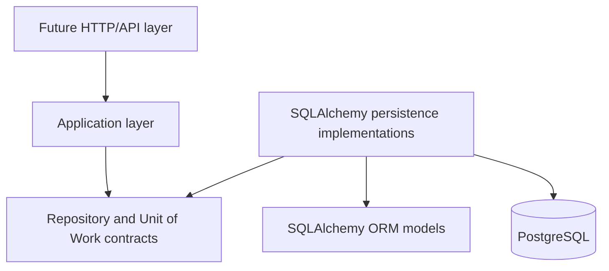

# Application Core and Persistence Architecture

## Goals

Stage `03.0.1` establishes the boundary rules for the future application core and PostgreSQL persistence layer. It defines dependency direction, package responsibilities, repository contract conventions, Unit of Work semantics, transaction ownership, tenant-safety rules, ORM entity usage policy, persistence error boundaries, relationship-loading conventions, write/read separation, testing expectations, and the implementation order for `03.0.2+`.

## Non-goals

This stage does not implement concrete repositories, a SQLAlchemy Unit of Work, API routes, FastAPI dependency wiring, Pydantic request or response schemas, lifecycle services, temporal replacement workflows, merge workflows, collectors, background jobs, event buses, partitioning, sharding, async SQLAlchemy, or new database tables. Existing merged Alembic migrations are not edited.

## Current-State Assessment

The current repository uses synchronous SQLAlchemy. `api/app/db/session.py` creates a synchronous engine with `create_engine(...)`, configures `SessionLocal = sessionmaker(..., expire_on_commit=False)`, exposes `get_session()`, and provides a small `transaction_session()` context manager that commits on successful exit and rolls back on exceptions.

Database settings are loaded through `DatabaseSettings` in `api/app/db/settings.py`. Alembic imports `app.models` in `api/alembic/env.py`, which registers all SQLAlchemy mapped models against `Base.metadata`. Tests create isolated PostgreSQL databases in `api/tests/conftest.py`, run Alembic to `head`, create synchronous sessions with `sessionmaker`, and roll back fixture sessions after use.

There is no existing application-service package, repository abstraction, Unit of Work abstraction, DTO hierarchy, or dependency-injection wiring. The repository should therefore preserve the current synchronous SQLAlchemy model and introduce only the minimum application-facing contracts needed to make the next stage explicit and testable.

## Dependency Direction



The application layer owns use-case decisions and depends on application-facing contracts. SQLAlchemy implementations adapt those contracts to ORM models and PostgreSQL.

## Dependency Matrix

| Source | May depend on | Must not depend on |
| --- | --- | --- |
| Future API layer | Application use cases, application errors, DTOs when introduced | SQLAlchemy sessions for write operations, concrete repositories |
| Application layer | ORM mapped entity types, application ports, application errors | SQLAlchemy `Session`, query APIs, driver exceptions, concrete persistence implementations |
| Application ports | Standard library typing and domain/entity types | SQLAlchemy, FastAPI, Pydantic, concrete persistence implementations |
| SQLAlchemy persistence | Application ports, application errors, ORM models, SQLAlchemy | API routing, business workflows outside persistence adaptation |
| ORM models | SQLAlchemy base/mixins and model relationships | Application services, repositories, API handlers |
| Infrastructure wiring | Application use cases and concrete implementations | Business logic |

## Package and Module Boundaries

The minimum package baseline is:

```text
api/app/application/
  errors.py
  ports/
    repositories.py
    unit_of_work.py
api/app/persistence/
  sqlalchemy/
```

`app.application` is the application core boundary. It contains application-facing errors and ports and must not import SQLAlchemy. `app.persistence.sqlalchemy` is the future adapter location for SQLAlchemy repositories and Unit of Work implementations. This stage intentionally keeps it as a boundary marker rather than adding concrete persistence behavior.

## Repository Contract Conventions

Repository contracts are synchronous protocols. Tenant-owned repository methods require an explicit `tenant_id`; normal operational methods must not accept `tenant_id: UUID | None = None` or infer tenant scope implicitly. Lookup methods return `Entity | None` for not-found and cross-tenant misses so callers do not learn whether an entity exists in another tenant.

Repository contracts express domain-oriented operations. They must not expose SQLAlchemy `Session`, `Select`, `Query`, `Row`, driver exceptions, FastAPI types, Pydantic types, unrestricted public CRUD, or generic `filter(**kwargs)` APIs. Repositories do not call `commit()`. Complex read projections, search, history views, and pagination may later be implemented through query services rather than generic repositories.

Global managed catalogs remain global. They use separate explicit contracts and must not be forced into tenant-owned repository conventions.

## Unit of Work Semantics

The application-facing Unit of Work supports:

```python
with unit_of_work:
    # access repositories and perform mutations
    unit_of_work.commit()
```

Entering the context opens one session and transaction. Multiple repositories exposed by the Unit of Work share that same session and transaction. `commit()` is explicit and owned by the Unit of Work. `rollback()` is explicit and may be called by the application when needed.

On exception, the Unit of Work rolls back and closes the session. When the context exits without an explicit successful commit, it also rolls back and closes the session. After a failed flush or commit, the Unit of Work is considered failed; callers should roll back, exit the context, and start a new Unit of Work. Repository instances are scoped to one Unit of Work lifetime and must not be reused after the Unit of Work closes.

## Transaction Ownership

One application command or use case normally owns one Unit of Work. Application services decide whether the operation succeeds. Repositories never commit and helper functions must not hide commits. External network calls should not normally run inside an open database transaction.

Read-only query services may later use a separate controlled session pattern. SQLAlchemy and PostgreSQL errors are translated at the persistence boundary. Retry behavior for deadlocks or serialization failures must be explicit at the application orchestration level and must not be hidden inside repositories.

## Tenant-Safety Rules

Tenant-owned repository methods require explicit tenant context. Lookups by entity id alone are prohibited for tenant-owned entities. There is no optional, ambient, or implicit tenant scope for normal application operations.

SQLAlchemy implementations must apply tenant predicates even when PostgreSQL composite foreign keys also enforce integrity. Cross-tenant misses return the same application-facing result as absent rows. Future global administrative access must use separate explicit contracts. Every future concrete repository issue must include tenant-isolation tests.

## ORM Mapped-Entity Policy

Existing SQLAlchemy mapped entities may initially serve as the entity representation used by application services, but SQLAlchemy `Session` and query APIs must not cross into the application layer.

This avoids duplicating the complete Resource Inventory model before repository behavior proves a need for separate pure domain entities. The trade-off is controlled coupling to mapped attributes and relationship behavior. Separate domain entities may be justified later if application logic needs persistence-independent invariants, non-SQLAlchemy execution, richer aggregate encapsulation, or a second storage technology. Until then, duplicating every mapped Resource Inventory entity would add churn without reducing a proven risk.

## Persistence Error Boundary

Application code raises application-facing errors:

- `ApplicationError`
- `EntityNotFoundError`
- `ConflictError`
- `ConcurrentModificationError`
- `TenantBoundaryError`
- `PersistenceError`

Future SQLAlchemy persistence implementations translate storage failures at the boundary. Translation should rely on stable information such as SQLSTATE, PostgreSQL constraint names, driver exception types, and SQLAlchemy optimistic concurrency exception types. Application code must not parse human-readable PostgreSQL error messages.

## Relationship-Loading Rules

Lazy loading must not unexpectedly occur outside an active Unit of Work. Repository methods define the relationship loading needed by each use case. They do not load the entire Resource graph by default and do not apply blanket eager loading. Read-heavy use cases should prefer projections or query services.

Critical query paths should later include query-count or SQL-shape tests. `SELECT ... FOR UPDATE` is reserved for explicit concurrent mutation workflows. Hidden refresh or expiration behavior must not be relied on without documentation.

## Write/Read Separation

Repositories support transactional entity and aggregate mutation workflows. Query services support projections, filtering, history, search, and pagination. Query services must enforce tenant scope. Large resource collections should prefer keyset or cursor pagination over deep offset pagination.

This is not a CQRS framework. This stage does not introduce a separate read database, event bus, or outbox.

## Testing Strategy

Architecture enforcement tests check that application modules do not import SQLAlchemy, ports do not import concrete persistence implementations, ports do not expose SQLAlchemy-facing types, tenant-scoped repository protocols require explicit tenant ids, Unit of Work lifecycle methods exist, package imports succeed, and the application error hierarchy is valid.

Future repository implementation issues must add integration tests proving tenant isolation, transaction behavior, no repository-level commits, error translation, relationship loading behavior, and query shape for critical paths.

## Accepted Trade-Offs

The project remains synchronous because the current engine, sessions, tests, and Alembic wiring are synchronous. ORM mapped entities may be used by application services initially to avoid premature duplication. The Unit of Work and repository modules are protocols only; concrete SQLAlchemy implementations begin in `03.0.2+`.

## Deferred Concerns

Deferred work includes the concrete SQLAlchemy Unit of Work, concrete repository contracts, shared SQLAlchemy repository helpers, use-case services, DTO/result types, persistence error translation matrix, query services, pagination, query-count tests, retry policy, external transaction orchestration, and any future decision to introduce pure domain entities.

## Implementation Roadmap

1. `03.0.2` — Implement SQLAlchemy Session and Unit of Work
2. `03.0.3` — Define Resource Inventory Repository Contracts
3. `03.0.4` — Implement Shared SQLAlchemy Repository Infrastructure
4. `03.0.5` — Implement Tenant and Organization Repositories
5. `03.0.6` — Implement Resource Repository
6. `03.0.7` — Implement Temporal Fact Persistence
7. `03.0.8` — Implement Alias and Merge Persistence
8. `03.0.9` — Implement Resource Lifecycle Application Services
9. `03.0.10` — Introduce Application DTOs and Result Types
10. `03.0.11` — Implement Persistence Error Translation
11. `03.0.12` — Implement Query Services and Pagination
12. `03.0.13` — Harden Persistence Integration Tests
13. `03.0.14` — Audit Application Core and Persistence Architecture
