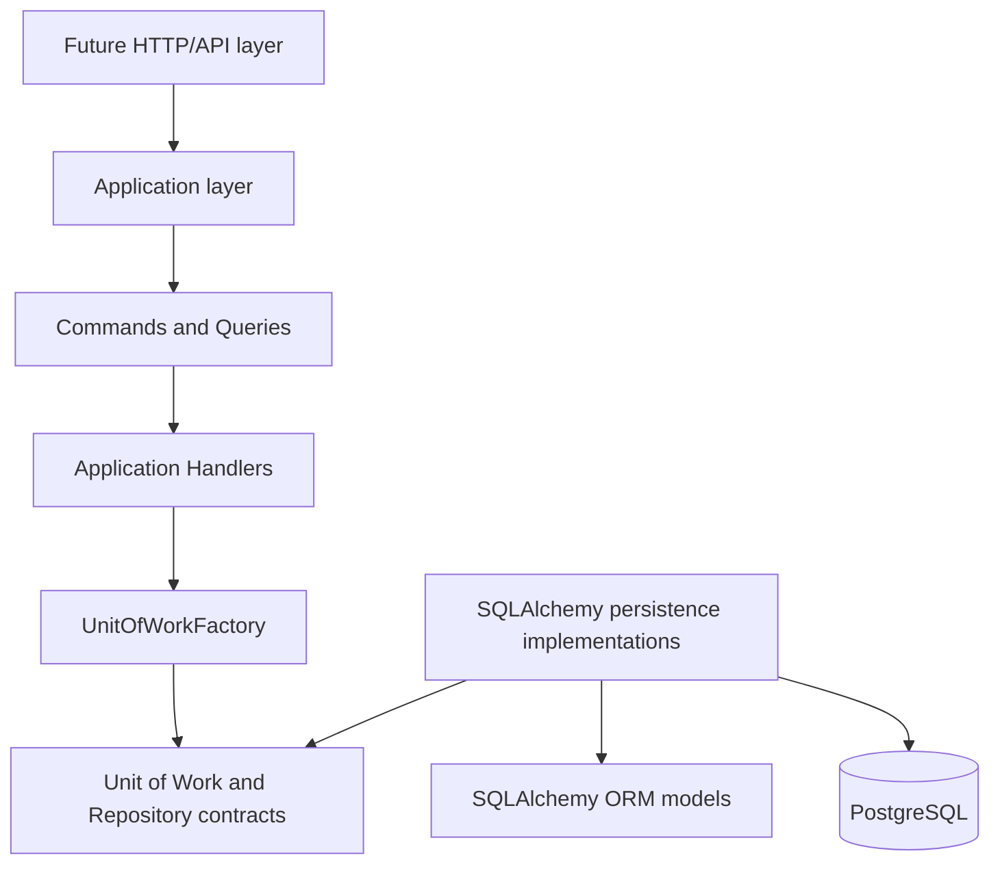
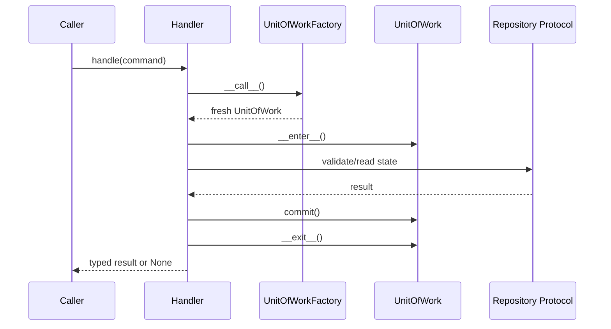
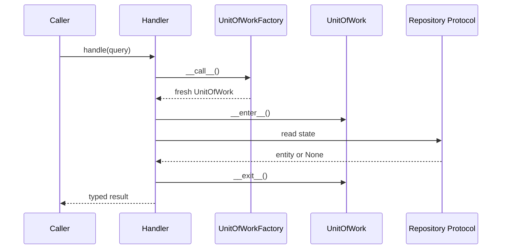

# Application Core and Persistence Architecture

## Goals

Stage `03.0` establishes the boundary rules for the application core and PostgreSQL persistence layer. Stage `03.1` starts the application-service architecture that orchestrates those persistence contracts. Together they define dependency direction, package responsibilities, command and query contracts, handler contracts, repository contract conventions, Unit of Work semantics, transaction ownership, tenant-safety rules, ORM entity usage policy, application result contracts, persistence error boundaries, relationship-loading conventions, write/read separation, testing expectations, and the implementation order for `03.0.2+`.

## Non-goals

This stage does not implement API routes, FastAPI dependency wiring, Pydantic request or response schemas, lifecycle business use cases, temporal replacement workflows, merge workflows, collectors, background jobs, command buses, mediators, handler registries, decorators, middleware, event buses, partitioning, sharding, async SQLAlchemy, or new database tables. Existing merged Alembic migrations are not edited.

## Current-State Assessment

The current repository uses synchronous SQLAlchemy. `api/app/db/session.py` creates a synchronous engine with `create_engine(...)`, centralizes `SessionLocal` through `create_session_factory(..., expire_on_commit=False)`, exposes `get_session()`, and provides a small `transaction_session()` context manager that commits on successful exit and rolls back on exceptions.

Database settings are loaded through `DatabaseSettings` in `api/app/db/settings.py`. Alembic imports `app.models` in `api/alembic/env.py`, which registers all SQLAlchemy mapped models against `Base.metadata`. Tests create isolated PostgreSQL databases in `api/tests/conftest.py`, run Alembic to `head`, create synchronous sessions with `sessionmaker`, and roll back fixture sessions after use.

The application-service package is intentionally small. It defines immutable command and query objects, generic handler protocols, typed result contracts, a UnitOfWorkFactory protocol, and minimal reference handlers. It does not introduce a command bus, automatic discovery, transport schemas, lifecycle business workflows, or dependency-injection framework wiring.

## Dependency Direction



The application layer owns use-case decisions and depends on application-facing contracts. Future transport code constructs command or query objects and invokes explicit handlers. Handlers depend on the application-facing `UnitOfWorkFactory` protocol, not on `SQLAlchemyUnitOfWork` or concrete repositories. SQLAlchemy implementations adapt Unit of Work and repository contracts to ORM models and PostgreSQL.

## Dependency Matrix

| Source | May depend on | Must not depend on |
| --- | --- | --- |
| Future API layer | Application use cases, application errors, DTOs when introduced | SQLAlchemy sessions for write operations, concrete repositories |
| Application layer | ORM mapped entity types through repository results, application ports, application errors, immutable commands, immutable queries, typed results | SQLAlchemy `Session`, query APIs, driver exceptions, concrete persistence implementations, FastAPI, Pydantic |
| Application ports | Standard library typing and domain/entity types | SQLAlchemy, FastAPI, Pydantic, concrete persistence implementations |
| SQLAlchemy persistence | Application ports, application errors, ORM models, SQLAlchemy | API routing, business workflows outside persistence adaptation |
| ORM models | SQLAlchemy base/mixins and model relationships | Application services, repositories, API handlers |
| Infrastructure wiring | Application use cases and concrete implementations | Business logic |

## Package and Module Boundaries

The minimum package baseline is:

```text
api/app/application/
  commands/
    resources.py
  errors.py
  handlers/
    protocols.py
    resources.py
  ports/
    catalogs.py
    labels.py
    lineage.py
    organizations.py
    repositories.py
    resources.py
    temporal.py
    tenants.py
    unit_of_work.py
  queries/
    resources.py
  results/
    resources.py
api/app/persistence/
  sqlalchemy/
    repositories/
```

`app.application` is the application core boundary. It contains application-facing commands, queries, handlers, results, errors, and ports and must not import SQLAlchemy, concrete persistence implementations, FastAPI, or Pydantic. `app.persistence.sqlalchemy` is the adapter location for SQLAlchemy persistence code. The concrete synchronous Unit of Work lives in `app.persistence.sqlalchemy.unit_of_work.SQLAlchemyUnitOfWork`; concrete repositories live under the same persistence boundary.

Every application subpackage contains meaningful code. Empty placeholder packages are not introduced. Command and query modules hold immutable data contracts. Handler modules hold explicit handler protocols and small directly-instantiated reference handlers. Result modules hold immutable typed application result shapes.

Shared SQLAlchemy repository infrastructure lives in `app.persistence.sqlalchemy.repositories`. It is an internal adapter package, not an application-facing contract package. `base.py` contains the session-bound base repository and direct binding helper, `tenant_scoped.py` contains tenant-owned repository primitives, and `helpers.py` contains small typed statement helpers for entity lookup, tenant-scoped lookup, explicit loader options, and opt-in `SELECT ... FOR UPDATE`.

The first concrete adapters are `SQLAlchemyTenantRepository` in `repositories/tenants.py`, `SQLAlchemyOrganizationRepository` in `repositories/organizations.py`, `SQLAlchemyResourceRepository` in `repositories/resources.py`, the managed catalog adapters in `repositories/catalogs.py`, the temporal fact adapters in `repositories/temporal.py`, and the lineage adapters in `repositories/lineage.py`. They implement application-facing protocols while remaining inside the SQLAlchemy persistence boundary.

## Repository Contract Conventions

Repository contracts are synchronous protocols. Tenant-owned repository methods require an explicit `tenant_id`; normal operational methods must not accept `tenant_id: UUID | None = None` or infer tenant scope implicitly. Lookup methods return `Entity | None` for not-found and cross-tenant misses so callers do not learn whether an entity exists in another tenant.

Repository contracts express domain-oriented operations. They must not expose SQLAlchemy `Session`, `Select`, `Query`, `Row`, driver exceptions, FastAPI types, Pydantic types, unrestricted public CRUD, or generic `filter(**kwargs)` APIs. Repositories do not call `commit()`. Complex read projections, search, history views, and pagination may later be implemented through query services rather than generic repositories.

Global managed catalogs remain global. They use separate explicit contracts and must not be forced into tenant-owned repository conventions.

The Resource Inventory repository inventory is:

| Repository | Tenant scoped | Primary responsibility | Mutation support |
| --- | --- | --- | --- |
| `TenantRepository` | No | Tenant lookup and creation by id or slug | `add` |
| `OrganizationRepository` | Yes | Organization access by id, canonical name, external key, and direct children | `add` |
| `ResourceRepository` | Yes | Resource aggregate access by id, canonical name, and explicit lock-oriented lookup | `add` |
| `LabelRepository` | Yes | Tenant label lookup by id or key/value and active-label listing | `add` |
| `ManagedCatalogRepository` | No | Global catalog lookup by id/code and active listing | Read-only |
| `ClassificationValueRepository` | No | Classification values scoped by classification type | Read-only |
| `ResourceIdentifierRepository` | Yes | Current identifier lookup by resource or normalized value | `add` |
| `ResourceOwnershipRepository` | Yes | Current ownership and current-primary ownership lookup | `add` |
| `ResourceRelationshipRepository` | Yes | Current incoming/outgoing resource relationships | `add` |
| `ResourceClassificationRepository` | Yes | Current classifications and current-primary classification lookup | `add` |
| `ResourceLabelRepository` | Yes | Current resource label assignments | `add` |
| `ResourceStateRepository` | Yes | Current state and state history access | `add` |
| `ResourceAliasRepository` | Yes | Alias-to-resource lookup and resource alias listing | `add` |
| `ResourceMergeRepository` | Yes | Outgoing and incoming merge lineage persistence | `add` |

Singular lookups return `Entity | None`. Collection methods return `Sequence[Entity]`. Existence methods return `bool`. Mutation methods return `None` and only attach rows to the active Unit of Work; they do not commit, roll back, open sessions, or own transaction lifecycle.

Tenant is the scope root, so `TenantRepository` does not require a separate tenant context. Tenant-owned repositories require explicit `tenant_id` for all read/access methods. `add(entity)` methods rely on the entity's own tenant fields and still run inside the caller's Unit of Work. Cross-tenant misses must remain indistinguishable from ordinary not-found results.

Global managed catalog repositories deliberately do not accept `tenant_id`; `resource_type`, `identifier_type`, `relationship_type`, `ownership_role`, `classification_type`, `classification_value`, `lifecycle_status`, `criticality`, and `exposure_level` remain global managed catalogs. `SQLAlchemyManagedCatalogRepository` is a small typed adapter for `ResourceType`, `IdentifierType`, `RelationshipType`, `OwnershipRole`, `ClassificationType`, `LifecycleStatus`, `Criticality`, and `ExposureLevel`. `SQLAlchemyClassificationValueRepository` is specialized because value lookup is scoped by `classification_type_id`.

The resource aggregate contract includes `get_for_update(...)` to reserve a place for explicit concurrent mutation workflows. It does not expose SQLAlchemy lock expressions. Identifier-based resource matching belongs to `ResourceIdentifierRepository`; canonical merge traversal belongs to later merge/query service work and is not exposed on `ResourceRepository` in this stage.

Temporal fact repositories expose current lookup boundaries and `add(...)`; `ResourceStateRepository` also exposes state history. They do not expose `close_current(...)`, `replace_current(...)`, history deletion, or a universal temporal repository framework because temporal replacement semantics belong to later application-service issues.

Alias and merge contracts expose alias resolution and merge-lineage persistence only. They do not implement merge execution, canonical traversal, alias transfer, deduplication, or conflict-resolution workflows.

Repository contracts are exposed through the application-facing Unit of Work protocol where concrete adapters now exist. The current neutral properties are `tenants: TenantRepository`, `organizations: OrganizationRepository`, `resources: ResourceRepository`, `resource_types: ManagedCatalogRepository[ResourceType]`, `identifier_types: ManagedCatalogRepository[IdentifierType]`, `relationship_types: ManagedCatalogRepository[RelationshipType]`, `ownership_roles: ManagedCatalogRepository[OwnershipRole]`, `classification_types: ManagedCatalogRepository[ClassificationType]`, `classification_values: ClassificationValueRepository`, `lifecycle_statuses: ManagedCatalogRepository[LifecycleStatus]`, `criticalities: ManagedCatalogRepository[Criticality]`, `exposure_levels: ManagedCatalogRepository[ExposureLevel]`, `resource_identifiers: ResourceIdentifierRepository`, `resource_ownerships: ResourceOwnershipRepository`, `resource_relationships: ResourceRelationshipRepository`, `resource_classifications: ResourceClassificationRepository`, `resource_labels: ResourceLabelRepository`, `resource_states: ResourceStateRepository`, `resource_aliases: ResourceAliasRepository`, and `resource_merges: ResourceMergeRepository`; they import only application-facing protocols and models and do not expose SQLAlchemy types. Future repository properties should be added as their concrete adapters are implemented.

The shared SQLAlchemy base repository exposes only internal primitives: attach an entity to the injected session, explicitly flush pending work, explicitly refresh an entity, evaluate prepared scalar or sequence statements, and test existence through a prepared statement. It deliberately does not expose a public generic CRUD interface, unrestricted `filter(**kwargs)`, generic query execution, destructive delete helpers, or transaction control. Concrete repositories own domain-specific methods such as tenant slug lookup; organization canonical-name, external-key, existence, and child-listing lookups; resource id, canonical-name, existence, and explicit lock-oriented lookups; read-only managed catalog lookup; append/read temporal fact lookup; exact alias lookup; resource alias listing; and direct merge-edge lookup. Label lookups remain deferred.

## Command and Query Contracts

Commands are immutable, technology-neutral data contracts. They carry validated or pre-validation input for a single application intent and do not contain business logic. They do not expose `execute()`, `commit()`, SQLAlchemy sessions, SQLAlchemy queries, FastAPI request objects, Pydantic models, or persistence implementations. The reference command is `EnsureResourceExistsCommand`, a narrow validation command used only to prove command-handler transaction rules.

Queries are immutable, technology-neutral read contracts. They carry lookup input for read-only handlers and do not expose SQLAlchemy `Result`, `Query`, `Select`, sessions, transactions, pagination frameworks, or specification objects. `GetResourceByIdQuery` is the narrow reference lookup from the architecture baseline. `GetResourceDetailsQuery` reads a full tenant-scoped resource projection by resource id. `GetResourceByCanonicalNameQuery` reads the same projection through the existing resource canonical-name repository contract.

Command and query objects are plain frozen dataclasses. Future commands and queries should remain data-only and should be instantiated directly by future transport or orchestration code.

## Handler Contracts

Handlers are explicit classes instantiated directly with constructor-injected dependencies. Generic handler protocols are:

```python
CommandHandler[C, R]
QueryHandler[Q, R]
```

Handlers depend on `UnitOfWorkFactory`, application commands, application queries, application results, and application errors. They do not depend on `SQLAlchemyUnitOfWork`, concrete repositories, FastAPI, Pydantic, middleware, decorators, command buses, handler registries, mediators, reflection, or automatic discovery.

Each handler execution creates exactly one Unit of Work by calling the injected factory. Command handlers validate through repositories inside that Unit of Work, call `commit()` exactly once after successful validation, and perform no repository operations after commit. Query handlers use one Unit of Work for read-only access and never call `commit()`. Rollback on validation errors, misses, exceptions, and uncommitted query exits is left to the Unit of Work context manager.

The first handlers are intentionally limited:

- `GetResourceByIdHandler` reads `uow.resources.get_by_id(...)` and returns a typed `ResourceReadResult`.
- `GetResourceDetailsHandler` reads `uow.resources.get_by_id(...)` and composes a fully materialized `ResourceDetailsResult`.
- `GetResourceByCanonicalNameHandler` reads `uow.resources.get_by_canonical_name(...)` and composes the same `ResourceDetailsResult`.
- `EnsureResourceExistsHandler` checks `uow.resources.exists(...)` and commits once only when the resource exists.

They do not create resources, update resources, implement lifecycle transitions, close temporal facts, execute merges, resolve canonical lineage, expose APIs, or define business workflows.

## UnitOfWorkFactory

Application handlers depend on:

```python
class UnitOfWorkFactory(Protocol):
    def __call__(self) -> UnitOfWork:
        ...
```

The factory returns a fresh Unit of Work for one handler execution. The application layer depends only on this protocol. Production wiring may later provide `SQLAlchemyUnitOfWork`, but `app.application` modules must not import it. Factories must not return a singleton Unit of Work, because concrete Unit of Work instances are single-use and own one transaction lifetime.

## Result Contracts

Application results are immutable typed dataclasses. They are transport-neutral and contain explicit fields rather than `dict[str, Any]`, HTTP response objects, Pydantic models, SQLAlchemy `Row` values, sessions, or lazy query objects.

`ResourceReadResult` is the narrow reference read result. `ResourceDetailsResult` is the first production read projection. It copies scalar resource fields and current related facts into immutable dataclasses:

- resource identity and metadata: `id`, `tenant_id`, `organization_id`, `resource_type_id`, `canonical_name`, `display_name`, `record_version`, `created_at`, `updated_at`
- current state: `ResourceStateResult | None`
- current identifiers: `tuple[ResourceIdentifierResult, ...]`
- current ownership: `tuple[ResourceOwnershipResult, ...]`
- current classifications: `tuple[ResourceClassificationResult, ...]`
- current labels: `tuple[ResourceLabelResult, ...]`
- aliases: `tuple[ResourceAliasResult, ...]`
- direct outgoing merge: `ResourceMergeResult | None`

Collection fields are tuples, never mutable lists. Result contracts do not expose ORM entities, lazy collections, sessions, dictionaries, HTTP response objects, Pydantic models, SQLAlchemy rows, or SQLAlchemy result objects. Future result contracts should follow the same policy unless a later use case explicitly documents a controlled mapped-entity return.

## Resource Read Query Composition

Resource read handlers compose projections only through existing Unit of Work repositories. They do not invent repository methods, bypass tenant scope, or reach into SQLAlchemy. `GetResourceDetailsHandler` first performs a tenant-scoped resource lookup. If the resource is absent, it raises `EntityNotFoundError` immediately and performs no related-fact reads. If the resource is present, it reads only the supported current/detail repositories needed for `ResourceDetailsResult`:

- `uow.resource_states.get_current(...)`
- `uow.resource_identifiers.get_current_for_resource(...)`
- `uow.resource_ownerships.get_current_for_resource(...)`
- `uow.resource_classifications.get_current_for_resource(...)`
- `uow.resource_labels.get_current_for_resource(...)`
- `uow.resource_aliases.list_for_resource(...)`
- `uow.resource_merges.get_outgoing_merge(...)`

`GetResourceByCanonicalNameHandler` uses `uow.resources.get_by_canonical_name(tenant_id, canonical_name)` as the initial lookup and then uses the same projection composition path. The handler does not trim, lowercase, normalize, or otherwise rewrite canonical names; repository behavior is the source of truth.

Every repository call receives the explicit `tenant_id`. Wrong-tenant lookups raise the same `EntityNotFoundError` shape as absent resources so handlers do not leak resource existence across tenant boundaries. All projection fields are copied before the Unit of Work context exits, and no repository is accessed after exit.

Pagination, search, filtering, resource lists, relationship graph expansion, canonical merge traversal, API serialization, and mutation workflows remain deferred.

## Application Error Policy

Application code raises technology-neutral application errors:

- `ApplicationError`
- `EntityNotFoundError`
- `ConflictError`
- `ValidationError`
- `ConcurrentModificationError`
- `TenantBoundaryError`
- `PersistenceError`

`ValidationError` may carry immutable `ValidationFailure` details. Application errors do not carry HTTP status codes, FastAPI exceptions, Pydantic validation objects, SQLAlchemy exceptions, driver exceptions, or storage-specific constraint details. Database exception translation remains deferred to the persistence error translation stage.

## Handler Transaction Flow

Command handlers use one Unit of Work, validate first, commit last, and rely on context-manager rollback for all unsuccessful paths:



Query handlers use one Unit of Work and never commit:



## Unit of Work Semantics

The application-facing Unit of Work supports:

```python
with unit_of_work:
    tenant = unit_of_work.tenants.get_by_slug("example")
    if tenant is not None:
        resource = unit_of_work.resources.get_by_canonical_name(
            tenant.id,
            "example.com",
        )
        unit_of_work.commit()
```

Entering the context opens one session and transaction. Multiple repositories exposed by the Unit of Work share that same session and transaction. `commit()` is explicit and owned by the Unit of Work. `rollback()` is explicit and may be called by the application when needed.

On exception, the Unit of Work rolls back and closes the session. When the context exits without an explicit successful commit, it also rolls back and closes the session. After a failed flush or commit, the Unit of Work is considered failed; callers should roll back, exit the context, and start a new Unit of Work. Repository instances are scoped to one Unit of Work lifetime and must not be reused after the Unit of Work closes.

The concrete SQLAlchemy implementation is single-use and follows explicit lifecycle states: `new`, `active`, `committed`, `rolled_back`, `failed`, and `closed`. It rejects commit, rollback, or session access before `__enter__`; rejects entering an already active instance; rejects reuse after closure; rejects a second commit; rejects rollback after commit; and rejects commit after rollback or failed transaction. Cleanup rollback is safe and repeated explicit rollback is idempotent while the Unit of Work is still open.

The concrete `session` property is infrastructure-facing and available only while the Unit of Work is active. It is not part of the application-facing `UnitOfWork` protocol. SQLAlchemy repositories attached to one Unit of Work receive this exact session instance and must never call `commit()`.

`SQLAlchemyUnitOfWork` accepts an injectable synchronous session factory. Production wiring uses the shared `SessionLocal` configured from the application engine. Tests inject their own isolated `sessionmaker` bound to the test engine. A Unit of Work creates exactly one session from the factory, closes that session on exit, and does not dispose the shared engine.

`SQLAlchemyUnitOfWork` constructs `SQLAlchemyTenantRepository`, `SQLAlchemyOrganizationRepository`, `SQLAlchemyResourceRepository`, one `SQLAlchemyManagedCatalogRepository` per global managed catalog, one `SQLAlchemyClassificationValueRepository`, all temporal fact repositories, `SQLAlchemyResourceAliasRepository`, and `SQLAlchemyResourceMergeRepository` when `__enter__()` opens the session. `uow.tenants`, `uow.organizations`, `uow.resources`, `uow.resource_types`, `uow.identifier_types`, `uow.relationship_types`, `uow.ownership_roles`, `uow.classification_types`, `uow.classification_values`, `uow.lifecycle_statuses`, `uow.criticalities`, `uow.exposure_levels`, `uow.resource_identifiers`, `uow.resource_ownerships`, `uow.resource_relationships`, `uow.resource_classifications`, `uow.resource_labels`, `uow.resource_states`, `uow.resource_aliases`, and `uow.resource_merges` are available only while the Unit of Work is active, share the same session, and are cleared on exit. SQLAlchemy repositories may also be constructed directly with an active session for focused tests or low-level integration. They do not create sessions, engines, nested transactions, or repository-owned transaction boundaries. Repository instances are scoped to that Unit of Work lifetime and are not safe to reuse after the Unit of Work closes.

Catalog lookup remains read-only at the application boundary:

```python
with SQLAlchemyUnitOfWork() as uow:
    resource_type = uow.resource_types.get_by_code("domain")
    lifecycle = uow.lifecycle_statuses.get_by_code("active")
    values = uow.classification_values.list_active_for_type(
        classification_type_id,
    )
```

Temporal fact reads use the same Unit of Work session and explicit tenant scope:

```python
with SQLAlchemyUnitOfWork() as uow:
    current_state = uow.resource_states.get_current(
        tenant_id,
        resource_id,
    )
    history = uow.resource_states.list_history(
        tenant_id,
        resource_id,
    )
```

Alias and merge lineage reads use direct lookup semantics only:

```python
with SQLAlchemyUnitOfWork() as uow:
    resource = uow.resource_aliases.find_resource_by_alias(
        tenant_id,
        "dns_name",
        "example.com",
    )
    outgoing_merge = uow.resource_merges.get_outgoing_merge(
        tenant_id,
        source_resource_id,
    )
```

## Transaction Ownership

One application command or use case normally owns one Unit of Work. Application handlers obtain that Unit of Work by calling an injected `UnitOfWorkFactory`. Application services decide whether the operation succeeds. Repositories never commit and helper functions must not hide commits. External network calls should not normally run inside an open database transaction.

Repository `add(...)`, lookup helpers, refresh helpers, and locking helpers never commit, roll back, close a session, dispose an engine, retry a failed transaction, or translate SQLAlchemy/database exceptions. A failed flush remains the Unit of Work's failed transaction; cleanup is handled by `SQLAlchemyUnitOfWork` rollback-on-exit or an explicit Unit of Work rollback. Repositories may flush only when the concrete operation requires generated/default values, early constraint validation, or subsequent dependent writes, and no helper commits after flushing.

Command handlers call `commit()` exactly once, after successful validation and repository interaction, and perform no repository operations after commit. Query handlers never call `commit()` and return typed result contracts rather than lazy session-bound query objects. Read-only query services may later use a separate controlled session pattern. SQLAlchemy and PostgreSQL errors are translated at the persistence boundary. Retry behavior for deadlocks or serialization failures must be explicit at the application orchestration level and must not be hidden inside repositories.

The existing `get_session()` helper remains available for lower-level framework integration. The existing `transaction_session()` helper remains for current low-level scripts or compatibility paths, but it is not the application-core transaction abstraction. New application command workflows should receive Unit of Work instances through `UnitOfWorkFactory`; outer infrastructure wiring may provide `SQLAlchemyUnitOfWork` behind that protocol.

## Tenant-Safety Rules

Tenant-owned repository methods require explicit tenant context. Lookups by entity id alone are prohibited for tenant-owned entities. There is no optional, ambient, or implicit tenant scope for normal application operations.

SQLAlchemy implementations must apply tenant predicates even when PostgreSQL composite foreign keys also enforce integrity. Cross-tenant misses return the same application-facing result as absent rows. Future global administrative access must use separate explicit contracts. Every future concrete repository issue must include tenant-isolation tests.

Tenant-scoped repository infrastructure requires explicit `tenant_id` for tenant-owned statement construction and entity lookup. The shared `tenant_select(...)` and `tenant_entity_select(...)` helpers centralize the tenant predicate; tenant-owned id lookup always includes both `tenant_id` and entity `id`. There is no `tenant_id=None` default, no ambient tenant scope, no `ignore_tenant` bypass flag, and no unscoped fallback helper on the tenant-scoped base. Global catalog repositories use `entity_select(...)` for primary-key lookup and direct SQLAlchemy 2.x statements for code and active-list lookups without tenant-scoped infrastructure.

All current managed catalog models use `code` and `is_active`; none define `sort_order`. Active-list methods therefore filter on `is_active IS true` and order by `code, id`. Classification-value active lists also filter by `classification_type_id`, exclude values from other types, and use the same `code, id` ordering within the type. Seeded rows are read through these repositories by their deterministic codes and UUIDs; the adapters do not duplicate seed data, alter seed codes, or expose catalog mutation.

Temporal fact repositories use `TenantScopedSQLAlchemyRepository` and the schema's current-row predicate, `valid_to IS NULL`. Current methods apply tenant scope plus their exact resource, value, role, type, or endpoint predicates and never load all history for Python-side filtering. State history uses the contract's only current history method and returns closed and current rows ordered by `valid_from, id`; other temporal contracts do not currently expose history methods. Current collection ordering is deterministic: identifiers by `identifier_type_id, namespace, normalized_value, id`; ownership by `ownership_role_id, is_primary DESC, organization_id, id`; outgoing relationships by `relationship_type_id, target_resource_id, id`; incoming relationships by `relationship_type_id, source_resource_id, id`; classifications by `classification_type_id, classification_value_id, id`; labels by `label_id, id`.

Temporal adapters are append/read only. `add(...)` attaches the new fact to the active Unit of Work session and does not flush automatically. Repositories do not close prior current rows, rewrite or delete history, validate state transitions, traverse organization hierarchies, resolve relationship graphs, create labels, mutate catalogs, translate database errors, or retry failed transactions. PostgreSQL constraints remain the source of truth for one-current-row rules, temporal interval validity, tenant-consistent resource references, relationship endpoint validity, classification type/value integrity, label assignment integrity, and original `IntegrityError` propagation.

Lineage adapters are append/read only. `SQLAlchemyResourceAliasRepository.find_resource_by_alias(tenant_id, alias_type, normalized_value)` performs an exact tenant-scoped match on the string alias type and normalized value, then returns the directly referenced `Resource` through a tenant-safe join. It does not normalize input, search identifiers, follow merge chains, resolve canonical resources, or apply fallback matching. `list_for_resource(...)` returns aliases for the direct resource ordered by `alias_type, normalized_value, id`.

`SQLAlchemyResourceMergeRepository.get_outgoing_merge(tenant_id, source_resource_id)` returns the direct outgoing merge edge for a source resource, if present. `list_incoming_merges(tenant_id, target_resource_id)` returns direct incoming edges ordered by `merged_at, id`. The adapter does not execute merges, transfer aliases or facts, update resource snapshots, recursively traverse lineage, materialize canonical ids, translate errors, or retry failed writes. PostgreSQL remains the source of truth for alias uniqueness, tenant-consistent resource references, alias seen-window checks, merge source and target references, self-merge rejection, one outgoing merge per source, merge cycle prevention, and original database exception propagation.

`SQLAlchemyOrganizationRepository` applies tenant scope to every read: id lookup, canonical-name lookup, external-key lookup, existence checks, and direct-child listing. Cross-tenant misses return the same `None`, `False`, or empty sequence shape as ordinary misses. Direct children are ordered by `canonical_name` and `id` so callers never rely on unspecified database row order.

`SQLAlchemyResourceRepository` applies tenant scope to every read: id lookup, canonical-name lookup, existence checks, and explicit `get_for_update(...)` locking lookup. Normal `get_by_id(...)` does not lock rows; `get_for_update(...)` applies the tenant predicate before wrapping the statement with `FOR UPDATE`, and the lock remains owned by the active Unit of Work transaction. Resource canonical names are indexed by tenant but are not currently unique, so direct canonical-name lookup uses deterministic `canonical_name, id` ordering and does not fall back to aliases, identifiers, or merge lineage.

## ORM Mapped-Entity Policy

Existing SQLAlchemy mapped entities may initially serve as the entity representation used by application services, but SQLAlchemy `Session` and query APIs must not cross into the application layer.

This avoids duplicating the complete Resource Inventory model before repository behavior proves a need for separate pure domain entities. The trade-off is controlled coupling to mapped attributes and relationship behavior. Separate domain entities may be justified later if application logic needs persistence-independent invariants, non-SQLAlchemy execution, richer aggregate encapsulation, or a second storage technology. Until then, duplicating every mapped Resource Inventory entity would add churn without reducing a proven risk.

## Persistence Error Boundary

Application code raises application-facing errors:

- `ApplicationError`
- `EntityNotFoundError`
- `ConflictError`
- `ValidationError`
- `ConcurrentModificationError`
- `TenantBoundaryError`
- `PersistenceError`

Future SQLAlchemy persistence implementations translate storage failures at the boundary. Translation should rely on stable information such as SQLSTATE, PostgreSQL constraint names, driver exception types, and SQLAlchemy optimistic concurrency exception types. Application code must not parse human-readable PostgreSQL error messages. The current Unit of Work deliberately preserves original SQLAlchemy/database exceptions; the translation matrix belongs to `03.1.4`.

## Relationship-Loading Rules

Lazy loading must not unexpectedly occur outside an active Unit of Work. Repository methods define the relationship loading needed by each use case. They do not load the entire Resource graph by default and do not apply blanket eager loading. Read-heavy use cases should prefer projections or query services.

Critical query paths should later include query-count or SQL-shape tests. `SELECT ... FOR UPDATE` is reserved for explicit concurrent mutation workflows. Hidden refresh or expiration behavior must not be relied on without documentation.

The shared loading helper only applies explicit SQLAlchemy loader options chosen by a concrete repository. It does not implement blanket eager loading, an include/expand framework, or global relationship-loading mutation. The locking helper only wraps a prepared statement with `with_for_update()` when a concrete repository asks for pessimistic locking; normal reads are not locked automatically, and no advisory locks, retry loops, deadlock handling, or lock timeout policy are introduced here.

`Resource` is currently the only mapped entity with SQLAlchemy optimistic concurrency enabled through `record_version` and `version_id_col`. Shared repository infrastructure preserves SQLAlchemy's normal version-check behavior and does not catch `StaleDataError`, translate it, disable version checks, or define a generic version-column convention for all models. Broader persistence error translation remains deferred to `03.1.4`.

## Write/Read Separation

Repositories support transactional entity and aggregate mutation workflows. Query services support projections, filtering, history, search, and pagination. Query services must enforce tenant scope. Large resource collections should prefer keyset or cursor pagination over deep offset pagination.

This is not a CQRS framework. This stage does not introduce a separate read database, event bus, or outbox.

## Testing Strategy

Architecture enforcement tests check that application modules do not import SQLAlchemy, FastAPI, Pydantic, or concrete persistence implementations; ports do not import concrete persistence implementations; ports do not expose SQLAlchemy-facing types; tenant-scoped repository protocols require explicit tenant ids; Unit of Work lifecycle methods exist; `UnitOfWorkFactory` returns the application-facing `UnitOfWork`; package imports succeed; handler protocols expose direct `handle(...)` contracts; reference handlers depend on `UnitOfWorkFactory`; and the application error hierarchy is valid.

SQLAlchemy Unit of Work integration tests verify explicit commit, rollback-by-default for inserts/updates/deletes/flushed rows, exception rollback and propagation, failed flush/commit cleanup, single-use lifecycle errors, session isolation, factory call count, shared engine usability after Unit of Work exit, protocol compliance, and compatibility with `get_session()` and `transaction_session()`.

Repository contract architecture tests verify that application-facing repository modules do not import SQLAlchemy or concrete persistence implementations, tenant-owned methods require non-optional `tenant_id`, global catalog contracts remain tenant-independent, repository contracts do not expose transaction or generic query methods, SQLAlchemy-facing types stay out of application signatures, collection methods use `Sequence`, and exported protocols define the expected signatures.

Shared SQLAlchemy repository infrastructure tests verify base attach/flush behavior, commit and rollback behavior through `SQLAlchemyUnitOfWork`, session sharing, Unit of Work-owned closure, tenant-scoped lookup and cross-tenant misses, tenant predicate SQL shape, global catalog separation, opt-in locking SQL shape, and preservation of SQLAlchemy optimistic concurrency for versioned `Resource` rows.

Tenant and Organization repository tests verify protocol compatibility, injected-session usage, lookup miss behavior, tenant isolation, direct-child ordering, duplicate constraint propagation as original SQLAlchemy/database exceptions, Unit of Work repository lifecycle, shared sessions, rollback-by-default, explicit commit persistence, and multi-repository atomicity.

Resource repository tests verify protocol compatibility, injected-session usage, tenant-scoped id and canonical-name lookups, non-locking normal reads, explicit `FOR UPDATE` lookup, Resource optimistic concurrency through SQLAlchemy `record_version`, Unit of Work resource lifecycle, and Tenant/Organization/Resource atomicity.

Managed catalog repository tests verify protocol compatibility, injected-session usage, seeded id/code lookup, missing id/code lookup, global no-tenant access, active filtering, deterministic ordering, classification-value type scoping, Unit of Work lifecycle, shared sessions, distinct Unit of Work instances, and read-only concrete adapter surfaces.

Temporal fact repository tests verify protocol compatibility, injected-session usage, current-row reads, state history reads, wrong-tenant misses, deterministic ordering, append-only add/flush behavior, rollback-by-default, explicit commit persistence, failed transaction cleanup, multi-repository atomicity, Unit of Work lifecycle, session sharing, and concrete adapter placement under persistence.

Lineage repository tests verify protocol compatibility, injected-session usage, exact alias-to-resource lookup, direct alias listing, direct outgoing and incoming merge-edge lookup, wrong-tenant misses, deterministic ordering, append-only add and explicit flush behavior, rollback-by-default, explicit commit persistence, failed transaction cleanup, multi-repository atomicity, database constraint preservation, Unit of Work lifecycle, session sharing, and concrete adapter placement under persistence.

Application service architecture tests verify immutable commands, immutable queries, immutable typed results, structural `UnitOfWorkFactory` compatibility, fresh Unit of Work creation per execution, command handler commit-on-success behavior, rollback on command validation failure, query handler no-commit behavior, rollback on query misses, technology-neutral validation failures, and reference handler compatibility with the existing SQLAlchemy Unit of Work through factory injection.

Future repository implementation issues must add integration tests proving tenant isolation, transaction behavior, no repository-level commits, error translation, relationship loading behavior, and query shape for critical paths.

## Accepted Trade-Offs

The project remains synchronous because the current engine, sessions, tests, and Alembic wiring are synchronous. ORM mapped entities may be used by application services initially to avoid premature duplication. The SQLAlchemy Unit of Work is concrete, and it exposes only concrete repositories whose application-facing protocols already exist.

## Deferred Concerns

Deferred work includes Label SQLAlchemy repository implementations; catalog mutation and catalog administration services; temporal fact replacement services; lineage services; real lifecycle command handlers; transport wiring; dependency-injection wiring; additional use-case services; broader DTO/result types; persistence error translation matrix; query services; pagination; merge execution; canonical traversal; alias transfer policy; query-count tests; retry policy; external transaction orchestration; and any future decision to introduce pure domain entities. Command buses, mediators, handler registries, middleware, decorators, and automatic discovery remain out of scope until a real repeated need appears.

## Implementation Roadmap

1. `03.0.2` — Implement SQLAlchemy Session and Unit of Work
2. `03.0.3` — Define Resource Inventory Repository Contracts
3. `03.0.4` — Implement Shared SQLAlchemy Repository Infrastructure
4. `03.0.5` — Implement Tenant and Organization Repositories
5. `03.0.6` — Implement Resource Repository
6. `03.0.7` — Implement Managed Catalog SQLAlchemy Repositories
7. `03.0.8` — Implement Temporal Fact Persistence
8. `03.0.9` — Implement Alias and Merge Persistence
9. `03.1.1` — Define Application Service and Command Architecture
10. `03.1.2` — Implement Resource Lifecycle Application Services
11. `03.1.3` — Expand Application DTOs and Result Types
12. `03.1.4` — Implement Persistence Error Translation
13. `03.1.5` — Implement Query Services and Pagination
14. `03.1.6` — Harden Persistence Integration Tests
15. `03.1.7` — Audit Application Core and Persistence Architecture
