# Application Core and Persistence Architecture

## Goals

Stage `03.0` establishes the boundary rules for the application core and PostgreSQL persistence layer. Stage `03.1` starts the application-service architecture that orchestrates those persistence contracts. Together they define dependency direction, package responsibilities, command and query contracts, handler contracts, repository contract conventions, Unit of Work semantics, transaction ownership, tenant-safety rules, ORM entity usage policy, application result contracts, persistence error boundaries, relationship-loading conventions, write/read separation, testing expectations, and the implementation order for `03.0.2+`. Stage `04.1.1` now defines the separate HTTP/API transport boundary in [api-and-service-layer.md](api-and-service-layer.md).

## Non-goals

This stage does not implement production API routes, broad lifecycle business workflows, generic temporal replacement frameworks, merge workflows, collectors, background jobs, command buses, mediators, handler registries, decorators, middleware, event buses, partitioning, sharding, async SQLAlchemy, or new database tables. Existing merged Alembic migrations are not edited. The HTTP transport package introduced in Stage `04.1.1` remains outside the application core.

## Current-State Assessment

The current repository uses synchronous SQLAlchemy. `api/app/db/session.py` creates a synchronous engine with `create_engine(...)`, centralizes `SessionLocal` through `create_session_factory(..., expire_on_commit=False)`, exposes `get_session()`, and provides a small `transaction_session()` context manager that commits on successful exit and rolls back on exceptions.

Database settings are loaded through `DatabaseSettings` in `api/app/db/settings.py`. Alembic imports `app.models` in `api/alembic/env.py`, which registers all SQLAlchemy mapped models against `Base.metadata`. Tests create isolated PostgreSQL databases in `api/tests/conftest.py`, run Alembic to `head`, create synchronous sessions with `sessionmaker`, and roll back fixture sessions after use.

The application-service package is intentionally small. It defines immutable command and query objects, generic handler protocols, typed result contracts, a UnitOfWorkFactory protocol, and minimal reference handlers. It does not introduce a command bus, automatic discovery, transport schemas, lifecycle business workflows, or dependency-injection framework wiring.

## Final 03.1 Resource Application Core Baseline

Stage `03.1` now contains the complete Resource application-core baseline for the current persistence model. The implemented workflow inventory is:

| Workflow | Contract | Handler | Result |
| --- | --- | --- | --- |
| Create base Resource | `CreateResourceCommand` | `CreateResourceHandler` | `ResourceCreatedResult` |
| Read Resource by id | `GetResourceByIdQuery` | `GetResourceByIdHandler` | `ResourceReadResult` |
| Read Resource details by id | `GetResourceDetailsQuery` | `GetResourceDetailsHandler` | `ResourceDetailsResult` |
| Read Resource temporal history by id | `GetResourceHistoryQuery` | `GetResourceHistoryHandler` | `ResourceHistoryResult` |
| Read Resource direct relationships by id | `GetResourceRelationshipsQuery` | `GetResourceRelationshipsHandler` | `ResourceRelationshipsResult` |
| Read Resource details by canonical name | `GetResourceByCanonicalNameQuery` | `GetResourceByCanonicalNameHandler` | `ResourceDetailsResult` |
| Replace current Resource state | `TransitionResourceStateCommand` | `TransitionResourceStateHandler` | `ResourceStateTransitionedResult` |
| Assign current identifier | `AssignResourceIdentifierCommand` | `AssignResourceIdentifierHandler` | `ResourceIdentifierAssignedResult` |
| Assign current ownership | `AssignResourceOwnershipCommand` | `AssignResourceOwnershipHandler` | `ResourceOwnershipAssignedResult` |
| Assign current relationship | `AssignResourceRelationshipCommand` | `AssignResourceRelationshipHandler` | `ResourceRelationshipAssignedResult` |
| Assign alias | `AssignResourceAliasCommand` | `AssignResourceAliasHandler` | `ResourceAliasAssignedResult` |
| Record merge lineage | `MergeResourceCommand` | `MergeResourceHandler` | `ResourceMergedResult` |
| Assign current classification | `AssignResourceClassificationCommand` | `AssignResourceClassificationHandler` | `ResourceClassificationAssignedResult` |
| Assign current label | `AssignResourceLabelCommand` | `AssignResourceLabelHandler` | `ResourceLabelAssignedResult` |
| Resolve canonical Resource | `ResolveCanonicalResourceQuery` | `ResolveCanonicalResourceHandler` | `CanonicalResourceResolvedResult` |

Read handlers use one fresh Unit of Work, perform tenant-scoped reads without write locks, materialize immutable results before Unit of Work exit, and never call `commit()`. Write handlers validate deterministic command-only data before opening a Unit of Work, perform explicit tenant-scoped checks and locks where required, mutate through narrow repositories, materialize immutable results before commit, call `commit()` exactly once as the final meaningful persistence operation, and perform no post-commit repository access.

All tenant-owned Resource workflows require explicit `tenant_id`. Wrong-tenant lookups return the same application miss shape as absent rows. There is no `tenant_id=None`, ambient tenant context, global fallback lookup, or bypass flag in application contracts or tenant-owned repository contracts.

Stage `03.3.4` closes Block 03 for the Application Core & Persistence Layer. Complete scope means the implemented Resource command handlers, Resource read handlers, repository ports, SQLAlchemy repositories, `ResourceQueryService`, SQLAlchemy Unit of Work, persistence error translation, read-model contracts, regression tests, and architecture documentation are audited and validated. This does not mean the overall backend is complete: production Resource API endpoints, collectors, advisories, matching, notifications, portals, advanced search, graph traversal, relationship history, production index tuning, and broader lifecycle workflows remain future blocks.

Final Block 03 responsibilities are deliberately separate. Application handlers orchestrate one use case and translate application-level misses/conflicts; transactional repositories provide focused aggregate and mutation-oriented access; `ResourceQueryService` owns projection-oriented Resource reads; `SQLAlchemyUnitOfWork` owns session, transaction, repository, and query-service lifecycle; SQLAlchemy adapters implement concrete database statements and persistence-error translation below the application boundary.

The current Resource details projection exposes the read model deliberately:

| Fact | Exposed in `ResourceDetailsResult`? |
| --- | --- |
| current state | yes |
| current identifiers | yes |
| current ownership | yes |
| current classifications | yes |
| current labels | yes |
| aliases | yes |
| relationships | no |
| direct outgoing merge | yes |
| canonical resolution | separate query |

Relationship facts are exposed through the separate Stage `03.3.3` one-hop relationship read model; `ResourceDetailsResult` and `ResourceHistoryResult` do not embed relationships. Canonical resolution is intentionally separate and no ordinary Resource read silently canonicalizes the requested resource. Stage `03.3.2` adds `ResourceHistoryResult` as a separate temporal read model for ResourceState, ResourceOwnership, ResourceLabel, ResourceClassification, and ResourceIdentifier rows. ResourceAlias is non-temporal and ResourceMerge lineage is not part of Resource history.

Final collection ordering and query-count matrix:

| Read path | Ordering | SELECT count |
| --- | --- | --- |
| Resource list | `resource.created_at`, `resource.id`; keyset cursor uses the same tuple | 1 per page |
| Exact identifier lookup | exact tenant/type/namespace/value match, singular database uniqueness | 1 |
| Exact alias lookup | exact tenant/alias type/normalized value match, singular database uniqueness | 1 |
| Details ownership | `ownership_role_id`, `is_primary DESC`, `organization_id`, `id` | included in details fixed plan |
| Details labels | label `key`, label `value`, `label_id`, assignment `id` | included in details fixed plan |
| Details classifications | `classification_type_id`, `classification_value_id`, `id` | included in details fixed plan |
| Details identifiers | `identifier_type_id`, namespace nulls first, namespace, `normalized_value`, `id` | included in details fixed plan |
| Details aliases | `alias_type`, `normalized_value`, `id` | included in details fixed plan |
| Resource details | current core/state/primary owner/merge plus current child collections and aliases | 6 for an existing Resource |
| History states | `valid_from`, `valid_to NULLS LAST`, `id` | included in history fixed plan |
| History ownership | `valid_from`, `valid_to NULLS LAST`, `ownership_role_id`, `organization_id`, `id` | included in history fixed plan |
| History labels | `valid_from`, `valid_to NULLS LAST`, label `key`, label `value`, `label_id`, assignment `id` | included in history fixed plan |
| History classifications | `valid_from`, `valid_to NULLS LAST`, `classification_type_id`, `classification_value_id`, `is_primary`, `id` | included in history fixed plan |
| History identifiers | `valid_from`, `valid_to NULLS LAST`, `identifier_type_id`, namespace nulls first, namespace, `normalized_value`, `id` | included in history fixed plan |
| Resource history | Resource core plus five temporal fact collections | 6 for an existing Resource; 1 for missing/wrong tenant |
| Resource relationships | outgoing before incoming, `relationship_type_id`, stored source id, stored target id, `id` | 2 for an existing Resource; 1 for missing/wrong tenant |
| Canonical resolution | iterative direct outgoing merge traversal with visited/depth guards | intentionally traversal-dependent |

## Dependency Direction

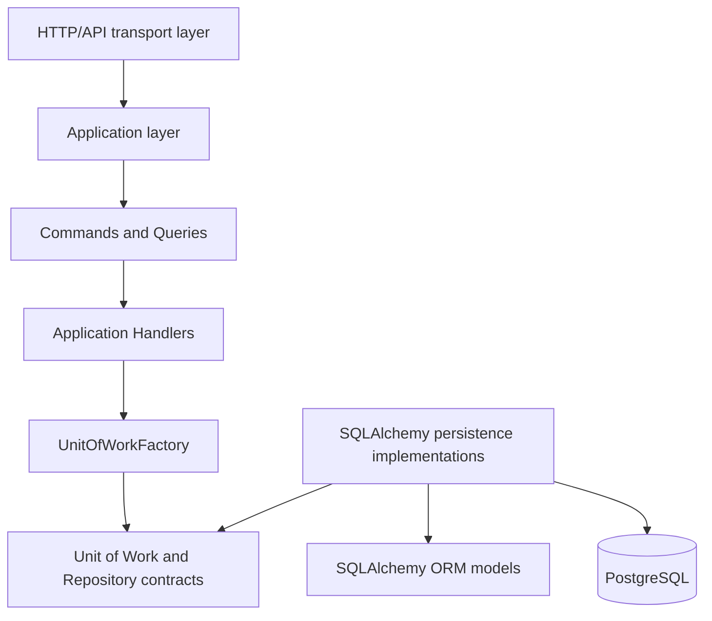

The application layer owns use-case decisions and depends on application-facing contracts. HTTP transport code constructs command or query objects and invokes explicit handlers across the boundary documented in [api-and-service-layer.md](api-and-service-layer.md). Handlers depend on the application-facing `UnitOfWorkFactory` protocol, not on `SQLAlchemyUnitOfWork` or concrete repositories. SQLAlchemy implementations adapt Unit of Work and repository contracts to ORM models and PostgreSQL.

## Dependency Matrix

| Source | May depend on | Must not depend on |
| --- | --- | --- |
| API transport layer | Application use cases, application errors, API-owned Pydantic schemas | SQLAlchemy sessions, ORM models as transport contracts, concrete repositories |
| Application layer | ORM mapped entity types through repository results, application ports, application errors, immutable commands, immutable queries, typed results | SQLAlchemy `Session`, query APIs, driver exceptions, concrete persistence implementations, FastAPI, Pydantic |
| Application ports | Standard library typing and domain/entity types | SQLAlchemy, FastAPI, Pydantic, concrete persistence implementations |
| SQLAlchemy persistence | Application ports, application errors, ORM models, SQLAlchemy | API routing, business workflows outside persistence adaptation |
| ORM models | SQLAlchemy base/mixins and model relationships | Application services, repositories, API handlers |
| Infrastructure wiring | Application use cases and concrete implementations | Business logic |

## Package and Module Boundaries

The minimum package baseline is:

```text
api/app/application/
  commands/
    resources.py
  errors.py
  handlers/
    protocols.py
    resources.py
  ports/
    catalogs.py
    labels.py
    lineage.py
    organizations.py
    repositories.py
    resources.py
    temporal.py
    tenants.py
    unit_of_work.py
  queries/
    resources.py
  results/
    resources.py
api/app/persistence/
  sqlalchemy/
    repositories/
```

`app.application` is the application core boundary. It contains application-facing commands, queries, handlers, results, errors, and ports and must not import SQLAlchemy, concrete persistence implementations, FastAPI, or Pydantic. `app.persistence.sqlalchemy` is the adapter location for SQLAlchemy persistence code. The concrete synchronous Unit of Work lives in `app.persistence.sqlalchemy.unit_of_work.SQLAlchemyUnitOfWork`; concrete repositories live under the same persistence boundary.

Every application subpackage contains meaningful code. Empty placeholder packages are not introduced. Command and query modules hold immutable data contracts. Handler modules hold explicit handler protocols and small directly-instantiated reference handlers. Result modules hold immutable typed application result shapes.

Shared SQLAlchemy repository infrastructure lives in `app.persistence.sqlalchemy.repositories`. It is an internal adapter package, not an application-facing contract package. `base.py` contains the session-bound base repository and direct binding helper, `tenant_scoped.py` contains tenant-owned repository primitives, and `helpers.py` contains small typed statement helpers for entity lookup, tenant-scoped lookup, explicit loader options, and opt-in `SELECT ... FOR UPDATE`.

The first concrete adapters are `SQLAlchemyTenantRepository` in `repositories/tenants.py`, `SQLAlchemyOrganizationRepository` in `repositories/organizations.py`, `SQLAlchemyResourceRepository` in `repositories/resources.py`, the managed catalog adapters in `repositories/catalogs.py`, the temporal fact adapters in `repositories/temporal.py`, and the lineage adapters in `repositories/lineage.py`. They implement application-facing protocols while remaining inside the SQLAlchemy persistence boundary.

## Repository Contract Conventions

Repository contracts are synchronous protocols. Tenant-owned repository methods require an explicit `tenant_id`; normal operational methods must not accept `tenant_id: UUID | None = None` or infer tenant scope implicitly. Lookup methods return `Entity | None` for not-found and cross-tenant misses so callers do not learn whether an entity exists in another tenant.

Repository contracts express domain-oriented operations. They must not expose SQLAlchemy `Session`, `Select`, `Query`, `Row`, driver exceptions, FastAPI types, Pydantic types, unrestricted public CRUD, or generic `filter(**kwargs)` APIs. Repositories do not call `commit()`. Complex read projections, search, history views, and pagination may later be implemented through query services rather than generic repositories.

Global managed catalogs remain global. They use separate explicit contracts and must not be forced into tenant-owned repository conventions.

The Resource Inventory repository inventory is:

| Repository | Tenant scoped | Primary responsibility | Mutation support |
| --- | --- | --- | --- |
| `TenantRepository` | No | Tenant lookup and creation by id or slug | `add` |
| `OrganizationRepository` | Yes | Organization access by id, canonical name, external key, and direct children | `add` |
| `ResourceRepository` | Yes | Resource aggregate access by id, canonical name, and explicit lock-oriented lookup | `add` |
| `LabelRepository` | Yes | Tenant label lookup by id or key/value and active-label listing | `add` |
| `ManagedCatalogRepository` | No | Global catalog lookup by id/code and active listing | Read-only |
| `ClassificationValueRepository` | No | Classification values scoped by classification type | Read-only |
| `ResourceIdentifierRepository` | Yes | Current identifier lookup by resource or normalized value | `add` |
| `ResourceOwnershipRepository` | Yes | Current ownership and current-primary ownership lookup | `add` |
| `ResourceRelationshipRepository` | Yes | Current incoming/outgoing resource relationships and exact current directed-edge lookup | `add` |
| `ResourceClassificationRepository` | Yes | Current classifications and current-primary classification lookup | `add` |
| `ResourceLabelRepository` | Yes | Current resource label assignments | `add` |
| `ResourceStateRepository` | Yes | Current state and state history access | `add` |
| `ResourceAliasRepository` | Yes | Alias-to-resource lookup and resource alias listing | `add` |
| `ResourceMergeRepository` | Yes | Outgoing and incoming merge lineage persistence | `add` |

Singular lookups return `Entity | None`. Collection methods return `Sequence[Entity]`. Existence methods return `bool`. Mutation methods return `None` and only attach rows to the active Unit of Work; they do not commit, roll back, open sessions, or own transaction lifecycle.

Tenant is the scope root, so `TenantRepository` does not require a separate tenant context. Tenant-owned repositories require explicit `tenant_id` for all read/access methods. `add(entity)` methods rely on the entity's own tenant fields and still run inside the caller's Unit of Work. Cross-tenant misses must remain indistinguishable from ordinary not-found results.

Global managed catalog repositories deliberately do not accept `tenant_id`; `resource_type`, `identifier_type`, `relationship_type`, `ownership_role`, `classification_type`, `classification_value`, `lifecycle_status`, `criticality`, and `exposure_level` remain global managed catalogs. `SQLAlchemyManagedCatalogRepository` is a small typed adapter for `ResourceType`, `IdentifierType`, `RelationshipType`, `OwnershipRole`, `ClassificationType`, `LifecycleStatus`, `Criticality`, and `ExposureLevel`. `SQLAlchemyClassificationValueRepository` is specialized because value lookup is scoped by `classification_type_id`.

The resource aggregate contract includes `get_for_update(...)` to reserve a place for explicit concurrent mutation workflows. It does not expose SQLAlchemy lock expressions. Identifier-based resource matching belongs to `ResourceIdentifierRepository`; canonical merge traversal is implemented as an application query that composes direct `ResourceRepository.get_by_id(...)` and `ResourceMergeRepository.get_outgoing_merge(...)` calls instead of adding a recursive lookup to `ResourceRepository`.

Temporal fact repositories expose current lookup boundaries and `add(...)`; `ResourceStateRepository` also exposes state history. They do not expose `close_current(...)`, `replace_current(...)`, history deletion, or a universal temporal repository framework because replacement semantics belong in explicit application-service commands.

Alias and merge contracts expose alias resolution and merge-lineage persistence only. They do not implement merge execution, alias transfer, deduplication, conflict-resolution workflows, path compression, or materialized canonical-resource caching.

Repository contracts are exposed through the application-facing Unit of Work protocol where concrete adapters now exist. The current neutral properties are `tenants: TenantRepository`, `organizations: OrganizationRepository`, `resources: ResourceRepository`, `resource_types: ManagedCatalogRepository[ResourceType]`, `identifier_types: ManagedCatalogRepository[IdentifierType]`, `relationship_types: ManagedCatalogRepository[RelationshipType]`, `ownership_roles: ManagedCatalogRepository[OwnershipRole]`, `classification_types: ManagedCatalogRepository[ClassificationType]`, `classification_values: ClassificationValueRepository`, `lifecycle_statuses: ManagedCatalogRepository[LifecycleStatus]`, `criticalities: ManagedCatalogRepository[Criticality]`, `exposure_levels: ManagedCatalogRepository[ExposureLevel]`, `resource_identifiers: ResourceIdentifierRepository`, `resource_ownerships: ResourceOwnershipRepository`, `resource_relationships: ResourceRelationshipRepository`, `resource_classifications: ResourceClassificationRepository`, `resource_labels: ResourceLabelRepository`, `resource_states: ResourceStateRepository`, `resource_aliases: ResourceAliasRepository`, and `resource_merges: ResourceMergeRepository`; they import only application-facing protocols and models and do not expose SQLAlchemy types. Future repository properties should be added as their concrete adapters are implemented.

The shared SQLAlchemy base repository exposes only internal primitives: attach an entity to the injected session, explicitly flush pending work, explicitly refresh an entity, evaluate prepared scalar or sequence statements, and test existence through a prepared statement. It deliberately does not expose a public generic CRUD interface, unrestricted `filter(**kwargs)`, generic query execution, destructive delete helpers, or transaction control. Concrete repositories own domain-specific methods such as tenant slug lookup; organization canonical-name, external-key, existence, and child-listing lookups; resource id, canonical-name, existence, and explicit lock-oriented lookups; read-only managed catalog lookup; append/read temporal fact lookup; exact alias lookup; resource alias listing; and direct merge-edge lookup. Label lookups remain deferred.

## Command and Query Contracts

Commands are immutable, technology-neutral data contracts. They carry validated or pre-validation input for a single application intent and do not contain business logic. They do not expose `execute()`, `save()`, `commit()`, SQLAlchemy sessions, SQLAlchemy queries, FastAPI request objects, Pydantic models, broad dictionaries, ORM entity inputs, or persistence implementations. `EnsureResourceExistsCommand` is a narrow validation command used only to prove command-handler transaction rules. `CreateResourceCommand` is the first production write command and carries exactly the fields required to create a base `Resource` row:

- `tenant_id: UUID`
- `resource_type_id: UUID`
- `canonical_name: str`
- `display_name: str`
- `lifecycle_status_id: UUID`
- `criticality_id: UUID`
- `exposure_level_id: UUID`
- `source_priority: int`
- `confidence_score: Decimal`
- `first_seen_at: datetime`
- `last_seen_at: datetime`

`TransitionResourceStateCommand` is the resource state replacement write command. It carries exactly the fields needed to replace the current `resource_state` row for one tenant-owned resource:

- `tenant_id: UUID`
- `resource_id: UUID`
- `lifecycle_status_id: UUID`
- `criticality_id: UUID`
- `exposure_level_id: UUID`
- `source_priority: int`
- `confidence_score: Decimal`
- `transitioned_at: datetime`
- `source: str | None`

Queries are immutable, technology-neutral read contracts. They carry lookup input for read-only handlers and do not expose SQLAlchemy `Result`, `Query`, `Select`, sessions, transactions, pagination frameworks, or specification objects. `GetResourceByIdQuery` is the narrow reference lookup from the architecture baseline. `GetResourceDetailsQuery` reads a full tenant-scoped resource projection by resource id. `GetResourceByCanonicalNameQuery` reads the same projection through the existing resource canonical-name repository contract. `ResolveCanonicalResourceQuery` resolves merge lineage for one tenant-owned resource and carries exactly `tenant_id: UUID` and `resource_id: UUID`.

Command and query objects are plain frozen dataclasses. Future commands and queries should remain data-only and should be instantiated directly by future transport or orchestration code.

## Handler Contracts

Handlers are explicit classes instantiated directly with constructor-injected dependencies. Generic handler protocols are:

```python
CommandHandler[C, R]
QueryHandler[Q, R]
```

Handlers depend on `UnitOfWorkFactory`, application commands, application queries, application results, and application errors. They do not depend on `SQLAlchemyUnitOfWork`, concrete repositories, FastAPI, Pydantic, middleware, decorators, command buses, handler registries, mediators, reflection, or automatic discovery.

Each handler execution creates exactly one Unit of Work by calling the injected factory. Command handlers validate through repositories inside that Unit of Work, call `commit()` exactly once after successful validation, and perform no repository operations after commit. Query handlers use one Unit of Work for read-only access and never call `commit()`. Rollback on validation errors, misses, exceptions, and uncommitted query exits is left to the Unit of Work context manager.

The first handlers are intentionally limited:

- `CreateResourceHandler` validates `CreateResourceCommand`, creates one base `Resource`, adds it through `uow.resources`, materializes `ResourceCreatedResult`, and commits exactly once.
- `GetResourceByIdHandler` reads `uow.resources.get_by_id(...)` and returns a typed `ResourceReadResult`.
- `GetResourceDetailsHandler` reads `uow.resource_queries.get_resource_details(...)` and returns a fully materialized `ResourceDetailsResult`.
- `GetResourceByCanonicalNameHandler` reads `uow.resources.get_by_canonical_name(...)` and then composes the same `ResourceDetailsResult` through `uow.resource_queries.get_resource_details(...)`.
- `ResolveCanonicalResourceHandler` reads `uow.resources.get_by_id(...)`, follows direct outgoing merge edges with `uow.resource_merges.get_outgoing_merge(...)`, and returns a typed `CanonicalResourceResolvedResult`.
- `EnsureResourceExistsHandler` checks `uow.resources.exists(...)` and commits once only when the resource exists.
- `TransitionResourceStateHandler` locks the resource with `uow.resources.get_for_update(...)`, closes the current `ResourceState` when present, appends the replacement state, updates the `Resource` snapshot fields, materializes `ResourceStateTransitionedResult`, and commits once as the final operation.

They do not create related facts, expose APIs, or define broader onboarding workflows. Merge execution records immediate lineage only, and canonical resolution reads lineage only.

## UnitOfWorkFactory

Application handlers depend on:

```python
class UnitOfWorkFactory(Protocol):
    def __call__(self) -> UnitOfWork:
        ...
```

The factory returns a fresh Unit of Work for one handler execution. The application layer depends only on this protocol. Production wiring may later provide `SQLAlchemyUnitOfWork`, but `app.application` modules must not import it. Factories must not return a singleton Unit of Work, because concrete Unit of Work instances are single-use and own one transaction lifetime.

## Result Contracts

Application results are immutable typed dataclasses. They are transport-neutral and contain explicit fields rather than `dict[str, Any]`, HTTP response objects, Pydantic models, SQLAlchemy `Row` values, sessions, or lazy query objects.

`ResourceCreatedResult` is the first production write result. It is materialized before commit and contains `resource_id`, `tenant_id`, `canonical_name`, and `record_version`. The `Resource` id is generated in Python during mapped entity construction through the UUIDv7 mixin, and the initial resource `record_version` follows the current mapper policy of starting at `1`, so the create handler does not expose a generic application-level flush operation.

`ResourceStateTransitionedResult` is materialized before commit and contains `resource_id`, `previous_state_id`, `new_state_id`, and `transitioned_at`. `previous_state_id` is `None` when the command creates the first state row for a resource. The replacement `ResourceState` id is generated in Python during mapped entity construction, so the transition handler also does not require an application-facing flush operation.

`ResourceReadResult` is the narrow reference read result. `ResourceDetailsResult` is the first production read projection. It copies scalar resource fields and current related facts into immutable dataclasses:

- resource identity and metadata: `id`, `tenant_id`, `organization_id`, `resource_type_id`, `canonical_name`, `display_name`, `record_version`, `created_at`, `updated_at`
- current state: `ResourceStateResult | None`
- current identifiers: `tuple[ResourceIdentifierResult, ...]`
- current ownership: `tuple[ResourceOwnershipResult, ...]`
- current classifications: `tuple[ResourceClassificationResult, ...]`
- current labels: `tuple[ResourceLabelResult, ...]`
- aliases: `tuple[ResourceAliasResult, ...]`
- direct outgoing merge: `ResourceMergeResult | None`

Collection fields are tuples, never mutable lists. Result contracts do not expose ORM entities, lazy collections, sessions, dictionaries, HTTP response objects, Pydantic models, SQLAlchemy rows, or SQLAlchemy result objects. Future result contracts should follow the same policy unless a later use case explicitly documents a controlled mapped-entity return.

`CanonicalResourceResolvedResult` is the canonical Resource resolution read result. It contains exactly `requested_resource_id`, `canonical_resource_id`, `immediate_target_resource_id`, `merge_depth`, `is_canonical`, and `canonical_resource`. `canonical_resource` is a `ResourceReadResult`, not a mapped entity. `immediate_target_resource_id` is the direct outgoing merge target from the requested resource when one exists. `canonical_resource_id` is the terminal resource reached after following outgoing merge edges. `merge_depth` is the number of traversed merge edges, and `is_canonical` is true only when depth is zero.

## Resource Read Query Composition

Stage `03.3.1` moves the Resource details read model behind the dedicated `ResourceQueryService` boundary. `GetResourceDetailsQuery` remains a frozen application query with exactly `tenant_id: UUID` and `resource_id: UUID`; it has no include flags, expand flags, history flag, pagination controls, canonical-resolution option, ORM types, or transport types. `GetResourceDetailsHandler` opens one fresh Unit of Work, calls `uow.resource_queries.get_resource_details(tenant_id, resource_id)`, maps `None` to `EntityNotFoundError(entity_type="Resource", lookup_field="resource_id", lookup_value=query.resource_id)`, materializes `ResourceDetailsResult`, and exits without commit, lock, flush, mutation, nested handler calls, or implicit canonical resolution.

`ResourceDetailsResult` preserves the established Stage `03.1` public fields: `id`, `tenant_id`, `organization_id`, `resource_type_id`, `canonical_name`, `display_name`, `record_version`, `created_at`, `updated_at`, `state`, `identifiers`, `ownership`, `classifications`, `labels`, `aliases`, and `outgoing_merge`. Nested results are immutable: `ResourceStateResult(id, lifecycle_status_id, criticality_id, exposure_level_id, source_priority, confidence_score, valid_from, source)`, `ResourceIdentifierResult(id, identifier_type_id, namespace, normalized_value, original_value, is_primary, confidence_score, valid_from)`, `ResourceOwnershipResult(id, organization_id, ownership_role_id, is_primary, confidence_score, valid_from, source)`, `ResourceClassificationResult(id, classification_type_id, classification_value_id, is_primary, confidence_score, valid_from, source)`, `ResourceLabelResult(id, label_id, valid_from, source)`, `ResourceAliasResult(id, alias_type, alias_value, normalized_value, source, first_seen_at, last_seen_at)`, and `ResourceMergeResult(id, source_resource_id, target_resource_id, reason, source, merged_at)`. Collection fields are tuples and all values are copied from scalar query-service projections before Unit of Work exit.

The details projection describes the requested stored Resource row. It does not automatically resolve `ResourceMerge` lineage, does not call `ResolveCanonicalResourceHandler`, and does not rewrite the result to the terminal canonical Resource. Existing direct outgoing merge metadata is preserved as `outgoing_merge` and represents only the immediate outgoing edge when one exists. Canonical resolution remains `ResolveCanonicalResourceQuery`.

Current fact semantics are explicit. `state` is the current `resource_state` row where `valid_to IS NULL`, when present. `organization_id` is the current primary `owner` organization using the same predicate as Resource listing: tenant match, resource match, seeded owner role, `is_primary IS true`, and `valid_to IS NULL`; absence of such a row leaves `organization_id` and `primary_ownership` projection absent without failing the query. `ownership` contains all current ownership rows for the resource, not history. `labels` contains current `resource_label` rows only. `classifications` contains all current `resource_classification` rows, including non-primary rows. `identifiers` contains current `resource_identifier` rows only. `aliases` contains all `resource_alias` rows for the resource because aliases are non-temporal in the current model. Historical temporal ownership, labels, classifications, identifiers, and state rows are excluded.

Details collection ordering is deterministic. Ownership is ordered by `ownership_role_id`, primary rows before non-primary rows, `organization_id`, then ownership id. Labels join `label` only for ordering and are ordered by label `key`, label `value`, `label_id`, then assignment id. Classifications are ordered by `classification_type_id`, `classification_value_id`, then classification id. Identifiers are ordered by `identifier_type_id`, namespace nulls first, namespace, `normalized_value`, then identifier id. Aliases are ordered by `alias_type`, `normalized_value`, then alias id.

The SQLAlchemy adapter implements `get_resource_details(...)` in `app.persistence.sqlalchemy.queries.resources.SQLAlchemyResourceQueryService` with a fixed six-SELECT plan: one scalar core query for `resource` plus current state, current primary owner, and direct outgoing merge; one query for all current ownership rows; one query for current labels; one query for current classifications; one query for current identifiers; and one query for aliases. Tenant-owned rows are always filtered by both `tenant_id` and `resource_id`. The implementation intentionally avoids a multiplicative cartesian join across ownership, labels, classifications, identifiers, and aliases; it also performs no N+1 row enrichment, no `OFFSET`, no count query, and no `DISTINCT`.

Resource details reads are resource-id anchored. Existing indexes support correctness and typical lookup paths: `uq_resource_tenant_id_id` on `resource`; `ix_resource_state_tenant_resource_valid_from`, `ix_resource_state_tenant_valid_to`, and `uq_resource_state_current`; `ix_resource_ownership_tenant_id_resource_id`, `ix_resource_ownership_tenant_resource_role`, `ix_resource_ownership_tenant_id_valid_to`, and the current/current-primary partial unique indexes; `ix_resource_label_tenant_resource_label`, `ix_resource_label_tenant_valid_to`, and `uq_resource_label_current`; `ix_resource_classification_tenant_resource_value`, `ix_resource_classification_tenant_resource_type`, `ix_resource_classification_tenant_valid_to`, and current partial unique indexes; `ix_resource_identifier_tenant_id_resource_id`, `ix_resource_identifier_tenant_id_valid_to`, and current identifier partial unique indexes; `ix_resource_alias_tenant_resource_id`; and `uq_resource_merge_tenant_source_resource_id`. A future measured performance issue could add partial tenant/resource/current covering indexes for temporal detail collections, but no migration is required for Stage `03.3.1`.

`GetResourceByCanonicalNameHandler` still uses `uow.resources.get_by_canonical_name(tenant_id, canonical_name)` for the initial canonical-name lookup and then calls `uow.resource_queries.get_resource_details(...)` for the same materialized read model. The handler does not trim, lowercase, normalize, or otherwise rewrite canonical names; repository behavior is the source of truth. Pagination, history/timeline views, relationship graph expansion, API serialization, and mutation workflows remain deferred.

Stage `03.3.2` adds `GetResourceHistoryQuery` as the dedicated temporal history workflow. It remains a frozen application query with exactly `tenant_id: UUID` and `resource_id: UUID`; it has no cursor, page size, include flags, history flag on details, canonical-resolution option, ORM types, SQLAlchemy types, FastAPI types, Pydantic types, repository handles, or sessions. `GetResourceHistoryHandler` opens one fresh Unit of Work, calls `uow.resource_queries.get_resource_history(tenant_id, resource_id)`, maps `None` to `EntityNotFoundError(entity_type="Resource", lookup_field="resource_id", lookup_value=query.resource_id)`, materializes `ResourceHistoryResult`, and exits without commit, rollback, lock, flush, mutation, nested handler calls, or canonical traversal.

`ResourceHistoryResult` contains `id`, `tenant_id`, `resource_type_id`, `canonical_name`, `display_name`, `states`, `ownership`, `labels`, `classifications`, and `identifiers`. Nested result types preserve stored intervals exactly, including `valid_to=None` for current rows: `ResourceStateHistoryResult(id, lifecycle_status_id, criticality_id, exposure_level_id, source_priority, confidence_score, valid_from, valid_to, source)`, `ResourceOwnershipHistoryResult(id, organization_id, ownership_role_id, is_primary, confidence_score, valid_from, valid_to, source)`, `ResourceLabelHistoryResult(id, label_id, valid_from, valid_to, source)`, `ResourceClassificationHistoryResult(id, classification_type_id, classification_value_id, is_primary, confidence_score, valid_from, valid_to, source)`, and `ResourceIdentifierHistoryResult(id, identifier_type_id, namespace, normalized_value, original_value, is_primary, confidence_score, valid_from, valid_to)`. Collection fields are tuples. No ORM entity, SQLAlchemy row, lazy collection, alias timeline, merge lineage, API DTO, or mutable collection crosses the application boundary.

History reads report stored temporal facts and do not reconstruct, validate, repair, merge, or truncate intervals. Each supported collection includes both closed historical rows (`valid_to IS NOT NULL`) and the current row (`valid_to IS NULL`) when present. ResourceState history includes all `resource_state` rows. Ownership history includes all `resource_ownership` rows, with no owner-role or primary-only filter. Label history includes all `resource_label` rows. Classification history includes all `resource_classification` rows, including primary and non-primary rows. Identifier history includes all `resource_identifier` rows without normalizing or rewriting values. ResourceAlias is excluded because its `first_seen_at` and `last_seen_at` are observation metadata, not temporal replacement intervals. ResourceMerge lineage history is excluded and remains separate from canonical resolution.

History collection ordering is deterministic and chronological. States are ordered by `valid_from ASC`, `valid_to NULLS LAST`, then id. Ownership is ordered by `valid_from ASC`, `valid_to NULLS LAST`, `ownership_role_id`, `organization_id`, then id. Labels join `label` only for ordering and are ordered by `valid_from ASC`, `valid_to NULLS LAST`, label `key`, label `value`, `label_id`, then assignment id. Classifications are ordered by `valid_from ASC`, `valid_to NULLS LAST`, `classification_type_id`, `classification_value_id`, `is_primary`, then id. Identifiers are ordered by `valid_from ASC`, `valid_to NULLS LAST`, `identifier_type_id`, namespace nulls first, namespace, `normalized_value`, then id.

The SQLAlchemy adapter implements `get_resource_history(...)` in `app.persistence.sqlalchemy.queries.resources.SQLAlchemyResourceQueryService` with exactly six scalar SELECTs: one Resource core/existence query, then one query each for ResourceState, ResourceOwnership, ResourceLabel, ResourceClassification, and ResourceIdentifier history. Missing or wrong-tenant Resources stop after the core SELECT and return `None`; child history queries do not run. Every history query is explicitly scoped by both `tenant_id` and `resource_id`, does not filter by `valid_to`, does not query ResourceAlias or ResourceMerge, does not use `OFFSET`, `COUNT`, `DISTINCT`, or hidden `LIMIT`, and avoids a cartesian join across temporal fact tables. The fixed query count is independent of history collection size.

Resource history reads are resource-id anchored. Existing indexes support correctness and typical lookup paths: `uq_resource_tenant_id_id` on `resource`; `ix_resource_state_tenant_resource_valid_from`; `ix_resource_ownership_tenant_id_resource_id` and `ix_resource_ownership_tenant_resource_role`; `ix_resource_label_tenant_resource_label`; `ix_resource_classification_tenant_resource_value` and `ix_resource_classification_tenant_resource_type`; and `ix_resource_identifier_tenant_id_resource_id`. These indexes cover tenant/resource lookup for each supported temporal table. If measured high-volume history reads need tighter ordering support, add follow-up indexes such as `(tenant_id, resource_id, valid_from, id)` on temporal fact tables. No migration is required for Stage `03.3.2`.

Stage `03.3.3` adds `GetResourceRelationshipsQuery` as the dedicated direct one-hop relationship workflow. It remains a frozen application query with exactly `tenant_id: UUID` and `resource_id: UUID`; it has no direction filter, relationship-type filter, cursor, page size, include flags, expand flags, graph traversal flag, canonical-resolution option, ORM types, SQLAlchemy types, FastAPI types, or Pydantic types. `GetResourceRelationshipsHandler` opens one fresh Unit of Work, calls `uow.resource_queries.get_resource_relationships(tenant_id, resource_id)`, maps `None` to `EntityNotFoundError(entity_type="Resource", lookup_field="resource_id", lookup_value=query.resource_id)`, materializes `ResourceRelationshipsResult`, and exits without commit, rollback, lock, flush, mutation, nested handler calls, relationship command handler calls, or canonical traversal.

`ResourceRelationship` is a tenant-scoped temporal/current fact table. Its audited scalar fields are `id`, `tenant_id`, `source_resource_id`, `target_resource_id`, `relationship_type_id`, `confidence_score`, `valid_from`, nullable `valid_to`, nullable `source`, and `created_at`. The table has tenant-safe composite foreign keys from `(tenant_id, source_resource_id)` and `(tenant_id, target_resource_id)` to `resource(tenant_id, id)`, a `relationship_type_id` foreign key to `relationship_type.id`, a self-edge check rejecting `source_resource_id = target_resource_id`, confidence and validity-window checks, source non-blank check, current uniqueness on `(tenant_id, source_resource_id, target_resource_id, relationship_type_id) WHERE valid_to IS NULL`, and indexes `ix_resource_relationship_tenant_id_source_resource_id`, `ix_resource_relationship_tenant_id_target_resource_id`, `ix_resource_relationship_tenant_id_relationship_type_id`, `ix_resource_relationship_tenant_source_type`, `ix_resource_relationship_tenant_target_type`, and `ix_resource_relationship_tenant_id_valid_to`.

`ResourceRelationshipsResult` contains `resource_id`, `tenant_id`, and `relationships: tuple[ResourceRelationshipResult, ...]`. Each `ResourceRelationshipResult` contains only stored scalar relationship data plus a relative direction: `id`, `relationship_type_id`, `source_resource_id`, `target_resource_id`, `direction`, `confidence_score`, `valid_from`, `source`, and `created_at`. Direction is represented as the string values `"outgoing"` and `"incoming"`. Outgoing means the requested Resource equals the stored `source_resource_id`; incoming means the requested Resource equals the stored `target_resource_id`. Stored `source_resource_id` and `target_resource_id` are never reversed or rewritten for presentation. Self-relationships are rejected by command validation and the database check constraint, so no self-edge direction branch is needed.

Relationship reads are current one-hop reads, not relationship history. Because `ResourceRelationship` has `valid_from` and `valid_to`, the relationship SELECT applies `valid_to IS NULL` and returns the current direct relationship set touching the requested stored Resource. Historical closed relationship rows are not included by this workflow. The result contains direct rows where the requested Resource is either source or target. It does not include neighbor-of-neighbor rows, dependency trees, graph paths, recursive traversal, transitive expansion, recursive CTEs, topology APIs, or a generic graph framework.

Ordering is deterministic and total. Outgoing rows sort before incoming rows through an explicit direction rank, then by `relationship_type_id`, stored `source_resource_id`, stored `target_resource_id`, and relationship id. The final id tie-breaker is present even though current uniqueness normally prevents identical tenant/source/type/target rows. No application deduplication or `DISTINCT` is used; each stored current relationship row maps to exactly one result row.

The SQLAlchemy adapter implements `get_resource_relationships(...)` in `app.persistence.sqlalchemy.queries.resources.SQLAlchemyResourceQueryService` with exactly two scalar SELECTs for an existing Resource: one Resource core/existence query and one current relationship query against `resource_relationship`. The relationship predicate is explicitly tenant-scoped and uses one OR query: `resource_relationship.tenant_id = :tenant_id`, `resource_relationship.valid_to IS NULL`, and `(source_resource_id = :resource_id OR target_resource_id = :resource_id)`. Missing or wrong-tenant Resources stop after the core SELECT and return `None`; the relationship SELECT does not run. The query does not load related Resource details, does not join relationship-type catalog labels, does not query `resource_merge`, does not use `OFFSET`, `COUNT`, `DISTINCT`, or hidden `LIMIT`, and does not perform N+1 enrichment.

Relationship reads describe the requested stored Resource. They do not automatically resolve `ResourceMerge` lineage, do not combine relationships for a canonical target with relationships for merged sources, do not rewrite source or target ids to canonical ids, and do not expose a `resolve_canonical` flag. Canonical Resource resolution remains the separate `ResolveCanonicalResourceQuery` workflow. Fully materializing the current one-hop set is the Stage `03.3.3` cardinality decision; pagination is deferred until measured relationship cardinality requires a separate contract. Existing source and target access paths are `ix_resource_relationship_tenant_id_source_resource_id`, `ix_resource_relationship_tenant_source_type`, `ix_resource_relationship_tenant_id_target_resource_id`, and `ix_resource_relationship_tenant_target_type`. PostgreSQL can use source-side and target-side indexes for the OR predicate; if measured production plans show pressure, a future issue can consider partial current indexes such as `(tenant_id, source_resource_id, relationship_type_id, target_resource_id, id) WHERE valid_to IS NULL` and `(tenant_id, target_resource_id, relationship_type_id, source_resource_id, id) WHERE valid_to IS NULL`. No migration is required for Stage `03.3.3`.

## Resource Creation Command

`CreateResourceHandler` is the first production application-layer write use case. It creates only the base `Resource` row. It does not automatically create `ResourceState`, identifiers, ownership, classifications, labels, aliases, relationships, or merge lineage.

Validation is deterministic and starts before a Unit of Work is created. The handler gathers command-only failures into one `ValidationError("Invalid resource creation command", failures=(...))` where practical:

- `canonical_name` must not be blank or whitespace-only, and the accepted value is preserved exactly.
- `display_name` must not be blank or whitespace-only because the current `Resource` model requires a non-null, non-blank display name.
- `source_priority` must be between `0` and `1000`, matching the current model/database constraint.
- `confidence_score` must be between `0` and `1`, matching the current `Numeric(5, 4)` model/database constraint.
- `first_seen_at` and `last_seen_at` must be timezone-aware.
- `last_seen_at` must not be earlier than `first_seen_at` when both timestamps are aware.

After command-only validation, the handler opens one fresh Unit of Work through `UnitOfWorkFactory`. It validates tenant existence through `uow.tenants.get_by_id(...)`. It validates required managed catalogs through `uow.resource_types`, `uow.lifecycle_statuses`, `uow.criticalities`, and `uow.exposure_levels` using existing `get_by_id(...)` contracts. Missing references raise `EntityNotFoundError` with `entity_type`, `lookup_field`, and `lookup_value`. Inactive managed catalog references raise `ConflictError` with `entity_type`, `conflict_field`, and `conflict_value`; catalog rows are never created or reactivated by this use case.

The canonical-name conflict guard is tenant-scoped and uses `uow.resources.get_by_canonical_name(command.tenant_id, command.canonical_name)`. It does not trim, lowercase, normalize, or globally search canonical names. Existing same-tenant matches raise `ConflictError`. The same canonical name in another tenant does not trigger the application pre-check. PostgreSQL constraints and foreign keys remain the concurrency-safe source of truth for races after application validation.

The handler constructs the current mapped `Resource` entity explicitly, following the project policy that mapped entities may initially serve as application entity representations. It sets only command-supported fields, does not manually set the generated UUID, does not construct related facts, and does not call SQLAlchemy APIs. No application-facing repository flush is added: the resource id is available at construction time, and `ResourceCreatedResult` only includes fields that are safely known before commit.

Successful create flow:

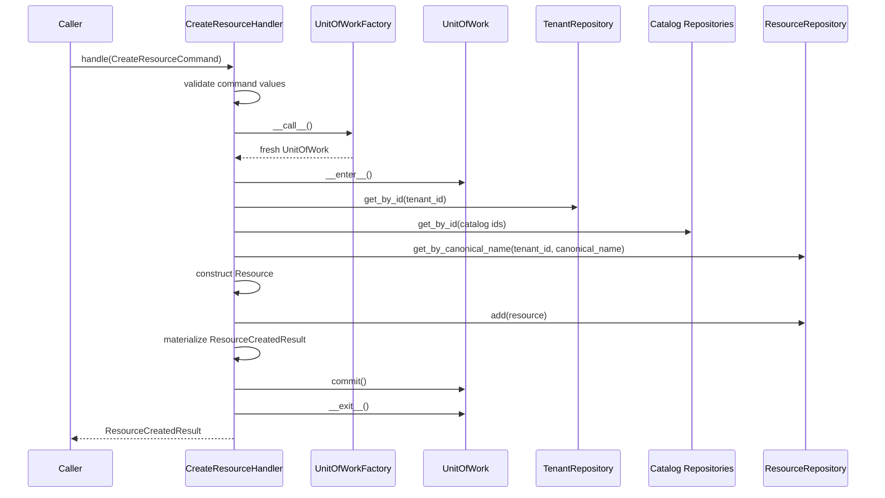

Commit is the final meaningful operation. After `uow.commit()`, the handler does not access repositories, Unit of Work properties, `uow.session`, the `Resource` entity, or lazy attributes. Failures propagate without explicit handler rollback; cleanup remains the Unit of Work context manager's responsibility.

## Resource State Transition Command

`TransitionResourceStateHandler` is the first production temporal replacement use case. It is intentionally specific to `ResourceState`; it does not introduce a reusable temporal mutation framework, a close-current repository helper, retry behavior, API schemas, migrations, or persistence adapter changes.

Validation starts before a Unit of Work is created. The handler rejects command-only failures with `ValidationError("Invalid resource state transition command", failures=(...))`:

- `source_priority` must be between `0` and `1000`, preserving compatibility with the current `Resource` snapshot constraint.
- `confidence_score` must be between `0` and `1`.
- `transitioned_at` must be timezone-aware.
- `source` may be `None`; when present it must not be blank or whitespace-only.

After command-only validation, the handler opens one fresh Unit of Work and locks the tenant-scoped resource through `uow.resources.get_for_update(tenant_id, resource_id)`. A missing resource or wrong-tenant resource raises the same `EntityNotFoundError` shape with `entity_type="Resource"` and `lookup_field="resource_id"`, and the handler performs no catalog or state reads afterward. The lock is acquired before current-state lookup so competing state transitions serialize on the resource row inside PostgreSQL. The stable automated coverage verifies this repository contract and operation order; it does not run a timing-sensitive multi-session blocking test.

The handler validates target `LifecycleStatus`, `Criticality`, and `ExposureLevel` through the global managed catalog repositories. Missing catalog rows raise `EntityNotFoundError`; inactive rows raise `ConflictError`; neither path mutates the current state. Catalogs are not created, reactivated, or tenant-scoped by this command.

The current state is loaded with `uow.resource_states.get_current(tenant_id, resource_id)`. If no current state exists, the command is allowed to create the first `ResourceState`, and the result reports `previous_state_id=None`. If a current state exists, `transitioned_at` must be strictly later than `current_state.valid_from`; equality is rejected. Unchanged transitions are rejected with `ConflictError("Resource state is unchanged", entity_type="ResourceState", conflict_field="state", conflict_value=resource_id)`. The no-op comparison includes `lifecycle_status_id`, `criticality_id`, `exposure_level_id`, `source_priority`, `confidence_score`, and `source`; it deliberately ignores ids and validity-window fields.

Successful replacement closes only the current row by setting `current_state.valid_to = transitioned_at`, constructs exactly one new `ResourceState` with `valid_from=transitioned_at` and `valid_to=None`, and adds it through `uow.resource_states.add(...)`. It also updates the locked `Resource` snapshot fields that mirror current state: `lifecycle_status_id`, `criticality_id`, `exposure_level_id`, `source_priority`, and `confidence_score`. This keeps the documented `resource`/current-`resource_state` invariant intact while preserving closed history rows unchanged. Resource state transitions do not modify observation timestamps such as `Resource.last_seen_at`; observation and discovery timestamps belong to a dedicated future observation workflow.

The handler materializes `ResourceStateTransitionedResult` before commit and calls `uow.commit()` once as the final meaningful operation. It does not call `flush()`: UUIDv7 ids are assigned when mapped objects are constructed, and the result needs no server-generated values. PostgreSQL constraints remain the final guard for races and invariant violations; broad `IntegrityError` translation, deadlock or serialization retries, and a generic temporal command framework remain deferred.

Successful transition flow:

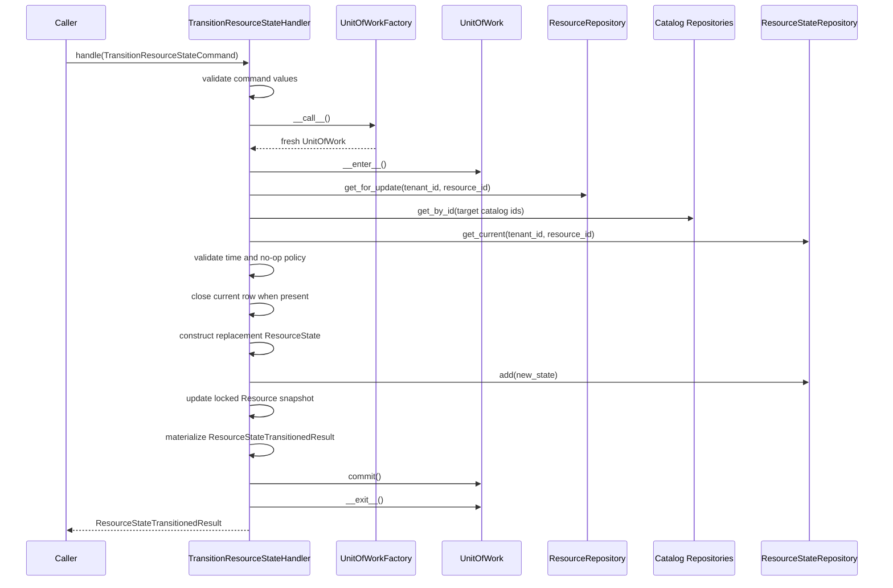

## Resource Identifier Assignment Command

`AssignResourceIdentifierHandler` appends one current `ResourceIdentifier` fact for an existing resource. This use case is assignment only: it does not replace identifiers, expire identifiers, reassign identifiers between resources, demote existing primary identifiers, delete history, create a normalization framework, add API schemas, or introduce a generic temporal mutation abstraction.

`AssignResourceIdentifierCommand` is an immutable transport-neutral dataclass with the actual fields required by the current `ResourceIdentifier` model: `tenant_id`, `resource_id`, `identifier_type_id`, `original_value`, `normalized_value`, `value_hash`, `namespace`, `is_primary`, `confidence_score`, and `valid_from`. The command carries `original_value`, `normalized_value`, and `value_hash` explicitly because no application-owned identifier normalization or hash algorithm exists yet. The handler preserves these accepted values exactly and does not trim, lowercase, canonicalize, punycode, parse, hash, or otherwise transform them.

Validation starts before a Unit of Work is created. The handler rejects command-only failures with `ValidationError("Invalid resource identifier assignment command", failures=(...))`: `original_value`, `normalized_value`, and `value_hash` must not be blank; `namespace` may be `None` but must not be blank when provided; `confidence_score` must be between `0` and `1`; and `valid_from` must be timezone-aware. There is no `source`, `source_priority`, or provenance field on the current identifier model, so the command does not carry or validate those concepts.

After command-only validation, the handler opens one fresh Unit of Work and locks the tenant-scoped resource through `uow.resources.get_for_update(tenant_id, resource_id)`. Missing resources and wrong-tenant resources raise `EntityNotFoundError("Resource not found", entity_type="Resource", lookup_field="resource_id", lookup_value=resource_id)`. The handler performs no `IdentifierType` lookup, identifier lookup, add, or commit after a resource miss. The resource lock is acquired before current-identifier inspection so competing identifier assignments serialize on the resource row inside PostgreSQL.

The handler validates `IdentifierType` through `uow.identifier_types.get_by_id(identifier_type_id)`. Missing identifier types raise `EntityNotFoundError`; inactive identifier types raise `ConflictError`; neither path mutates identifiers. Catalog rows are not created, reactivated, or queried through SQLAlchemy directly by the handler.

Current duplicate checks use `uow.resource_identifiers.find_current_by_value(tenant_id, identifier_type_id, normalized_value, namespace)`. If the exact current identifier already belongs to the same resource, the handler raises `ConflictError("Resource identifier is already assigned", entity_type="ResourceIdentifier", conflict_field="current_value", conflict_value=normalized_value)` and creates no redundant history row. If the exact current identifier belongs to a different resource in the same tenant, this assignment command does not move it, close it, or duplicate persistence constraint mapping logic; PostgreSQL's `uq_resource_identifier_current_value` constraint and the Unit of Work persistence translator enforce that collision at commit.

Primary assignment uses the schema-defined scope: one current primary identifier per `tenant_id`, `resource_id`, and `identifier_type_id`. When `is_primary=True`, the handler calls `uow.resource_identifiers.get_current_primary(tenant_id, resource_id, identifier_type_id)`. An existing current primary raises `ConflictError("Resource identifier primary already exists", entity_type="ResourceIdentifier", conflict_field="current_primary", conflict_value=identifier_type_id)` before mutation. This issue deliberately does not implement primary replacement or silent demotion.

On success, the handler constructs exactly one `ResourceIdentifier` with `valid_from=command.valid_from` and `valid_to=None`, adds it through `uow.resource_identifiers.add(...)`, materializes `ResourceIdentifierAssignedResult`, and calls `uow.commit()` exactly once as the final meaningful operation. It does not call `flush()` because identifier ids are Python-generated and no server-generated fields are needed for the result. After commit it does not access repositories, Unit of Work properties, entities, or lazy attributes. Failures propagate without explicit handler rollback; Unit of Work cleanup owns rollback and session closure.

Successful assignment flow:

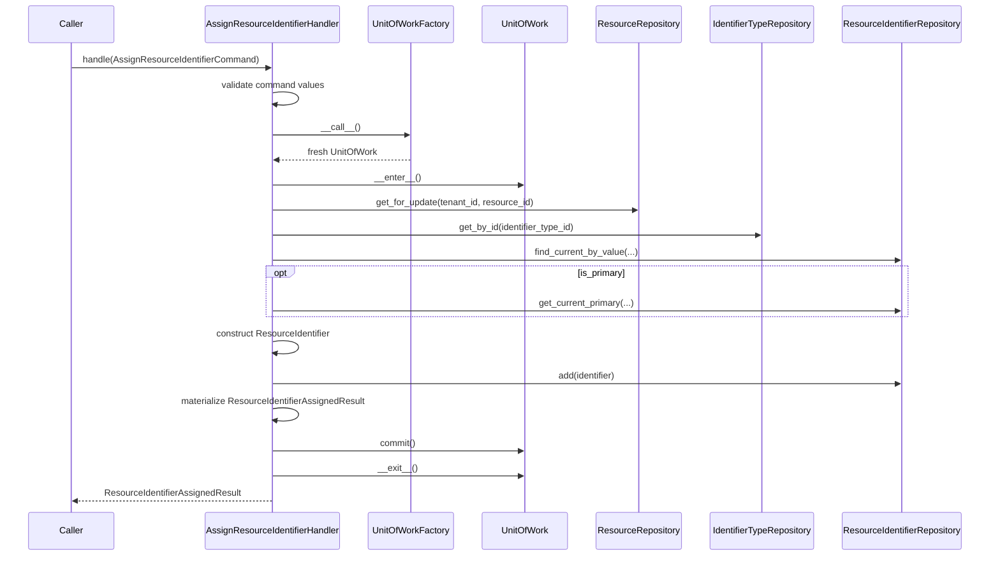

## Resource Ownership Assignment Command

`AssignResourceOwnershipHandler` appends one current `ResourceOwnership` fact for an existing resource and organization. This use case is assignment only: it does not replace ownership, expire ownership, transfer ownership between organizations, demote existing primary ownership, close current rows, delete history, create organizations, add API schemas, or introduce a generic temporal mutation abstraction.

`AssignResourceOwnershipCommand` is an immutable transport-neutral dataclass with the actual fields required by the current `ResourceOwnership` model: `tenant_id`, `resource_id`, `organization_id`, `ownership_role_id`, `is_primary`, `confidence_score`, `valid_from`, and nullable `source`.

Validation starts before a Unit of Work is created. The handler rejects command-only failures with `ValidationError("Invalid resource ownership assignment command", failures=(...))`: `confidence_score` must be between `0` and `1`; `valid_from` must be timezone-aware; and `source` may be `None` but must not be blank when provided.

After command-only validation, the handler opens one fresh Unit of Work and locks the tenant-scoped resource through `uow.resources.get_for_update(tenant_id, resource_id)`. Missing resources and wrong-tenant resources raise `EntityNotFoundError("Resource not found", entity_type="Resource", lookup_field="resource_id", lookup_value=resource_id)`. The handler performs no organization lookup, role lookup, ownership lookup, add, or commit after a resource miss.

The handler validates the target organization through `uow.organizations.get_by_id(tenant_id, organization_id)`. Missing organizations and wrong-tenant organizations raise `EntityNotFoundError("Organization not found", entity_type="Organization", lookup_field="organization_id", lookup_value=organization_id)`. The current organization model exposes `status` and `archived_at`, but no application write-eligibility policy exists for ownership assignment yet, so the handler does not invent one.

The handler validates `OwnershipRole` through `uow.ownership_roles.get_by_id(ownership_role_id)`. Missing roles raise `EntityNotFoundError`; inactive roles raise `ConflictError`; neither path mutates ownership. Role rows are not created or reactivated by this command.

Current duplicate checks use `uow.resource_ownerships.find_current(tenant_id, resource_id, organization_id, ownership_role_id)`. If an equivalent current ownership already exists, the handler raises `ConflictError("Resource ownership is already assigned", entity_type="ResourceOwnership", conflict_field="current", conflict_value=organization_id)` and creates no redundant history row.

Primary assignment uses the schema-defined scope: one current primary owner per `tenant_id`, `resource_id`, and `ownership_role_id`. When `is_primary=True`, the handler calls `uow.resource_ownerships.get_current_primary(tenant_id, resource_id, ownership_role_id)`. An existing current primary raises `ConflictError("Resource ownership primary already exists", entity_type="ResourceOwnership", conflict_field="current_primary", conflict_value=ownership_role_id)` before mutation. This issue deliberately does not implement primary replacement or silent demotion.

On success, the handler constructs exactly one `ResourceOwnership` with `valid_from=command.valid_from` and `valid_to=None`, adds it through `uow.resource_ownerships.add(...)`, materializes `ResourceOwnershipAssignedResult`, and calls `uow.commit()` exactly once as the final meaningful operation. It does not call `flush()` because ownership ids are Python-generated and no server-generated fields are needed for the result. After commit it does not access repositories, Unit of Work properties, entities, or lazy attributes. Failures propagate without explicit handler rollback; Unit of Work cleanup owns rollback and session closure. Commit-time persistence translation remains available for ownership uniqueness races through `uq_resource_ownership_current` and `uq_resource_ownership_current_primary`.

Successful ownership assignment flow:

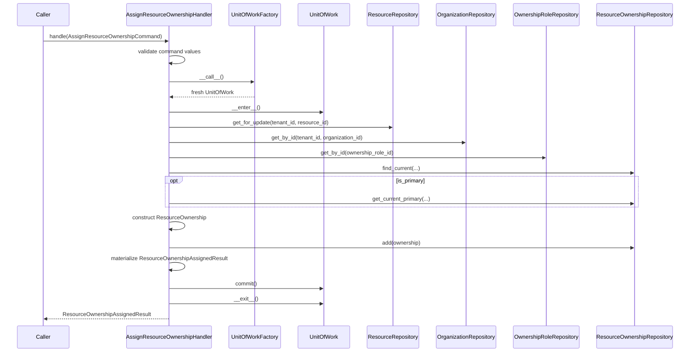

## Resource Relationship Assignment Command

`AssignResourceRelationshipHandler` appends one current `ResourceRelationship` fact between two existing tenant-owned resources. This use case is assignment only: it does not replace relationships, expire relationships, remove relationships, generate inverse rows, expand transitive edges, traverse graphs, close current rows, delete history, add API schemas, or introduce a generic temporal mutation abstraction.

`AssignResourceRelationshipCommand` is an immutable transport-neutral dataclass with the actual fields required by the current `ResourceRelationship` model: `tenant_id`, `source_resource_id`, `relationship_type_id`, `target_resource_id`, `confidence_score`, `valid_from`, and nullable `source`. The command does not carry `first_seen_at`, `last_seen_at`, `attributes`, inverse semantics, or graph traversal options because the mapped relationship table does not contain those fields.

Validation starts before a Unit of Work is created. The handler rejects command-only failures with `ValidationError("Invalid resource relationship assignment command", failures=(...))`: `source_resource_id` and `target_resource_id` must differ; `confidence_score` must be between `0` and `1`; `valid_from` must be timezone-aware; and `source` may be `None` but must not be blank when provided. Self-reference rejection is performed before opening a Unit of Work and is also protected by the database check constraint.

After command-only validation, the handler opens one fresh Unit of Work and locks both tenant-scoped endpoint resources through `uow.resources.get_for_update(tenant_id, resource_id)`. To avoid opposite-direction deadlock patterns, endpoint resource ids are sorted by stable UUID string for lock acquisition. This lock order is independent of relationship direction: the persisted row still preserves the command's original `source_resource_id -> target_resource_id` semantics. Missing or wrong-tenant endpoints raise `EntityNotFoundError("Resource not found", entity_type="Resource", lookup_field="source_resource_id" | "target_resource_id", lookup_value=...)` according to the semantic command role, not lock order. The handler performs no relationship type lookup, relationship lookup, add, or commit after an endpoint miss.

The handler validates `RelationshipType` through `uow.relationship_types.get_by_id(relationship_type_id)`. Missing types raise `EntityNotFoundError`; inactive types raise `ConflictError`; neither path mutates relationships. `RelationshipType` currently exposes optional `source_type_constraint` and `target_type_constraint` strings, but the schema and application layer do not define a deterministic interpreter that maps those strings to `Resource.resource_type_id` or catalog codes. The assignment command therefore does not invent endpoint type-constraint enforcement; a future workflow can add a documented constraint language and tests if needed.

Current duplicate checks use `uow.resource_relationships.find_current(tenant_id, source_resource_id, relationship_type_id, target_resource_id)`. If an equivalent current directed relationship already exists, the handler raises `ConflictError("Resource relationship is already assigned", entity_type="ResourceRelationship", conflict_field="current", conflict_value=relationship_type_id)` and creates no redundant history row. Reverse direction is not a duplicate: `A -> B` and `B -> A` are distinct directed facts. The same endpoints with a different relationship type are also distinct facts.

On success, the handler constructs exactly one `ResourceRelationship` with `valid_from=command.valid_from` and `valid_to=None`, adds it through `uow.resource_relationships.add(...)`, materializes `ResourceRelationshipAssignedResult`, and calls `uow.commit()` exactly once as the final meaningful operation. It does not call `flush()` because relationship ids are Python-generated and no server-generated fields are needed for the result. After commit it does not access repositories, Unit of Work properties, entities, or lazy attributes. Failures propagate without explicit handler rollback; Unit of Work cleanup owns rollback and session closure. Commit-time persistence translation remains available for relationship uniqueness races through `uq_resource_relationship_current`.

Successful relationship assignment flow:

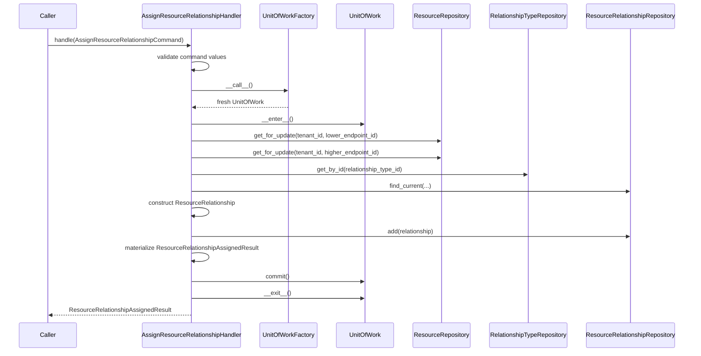

## Resource Alias Assignment Command

`AssignResourceAliasHandler` appends one `ResourceAlias` row for an existing tenant-owned resource. This use case is assignment only: it does not normalize aliases, update existing aliases, re-observe aliases, delete aliases, transfer aliases, execute merges, resolve canonical resources, add API schemas, or introduce an alias matching framework.

`AssignResourceAliasCommand` is an immutable transport-neutral dataclass with the actual fields required by the current `ResourceAlias` model: `tenant_id`, `resource_id`, `alias_type`, `alias_value`, `normalized_value`, nullable `source`, `first_seen_at`, and `last_seen_at`. The handler preserves `alias_value` and `normalized_value` exactly as supplied by the caller. `alias_value` is the original observed value; `normalized_value` is the lookup identity produced upstream. This handler does not derive normalized values, trim accepted values, lowercase, parse URLs, canonicalize DNS names, normalize IP addresses, hash aliases, or apply regex rules.

Validation starts before a Unit of Work is created. The handler rejects command-only failures with `ValidationError("Invalid resource alias assignment command", failures=(...))`: `alias_type`, `alias_value`, and `normalized_value` must not be blank; nullable `source` must not be blank when present; `first_seen_at` and `last_seen_at` must be timezone-aware; and `last_seen_at` must not be earlier than `first_seen_at`.

After command-only validation, the handler opens one fresh Unit of Work and locks the tenant-scoped resource through `uow.resources.get_for_update(tenant_id, resource_id)`. Missing resources and wrong-tenant resources raise `EntityNotFoundError("Resource not found", entity_type="Resource", lookup_field="resource_id", lookup_value=resource_id)`. The handler performs no alias lookup, add, or commit after a resource miss.

Alias identity follows the database uniqueness key: `tenant_id + alias_type + normalized_value`. The handler checks that identity through `uow.resource_aliases.find_resource_by_alias(tenant_id, alias_type, normalized_value)`, which returns the tenant-scoped resource that currently owns the alias key. If it resolves to the command resource, the handler raises `ConflictError("Resource alias is already assigned", entity_type="ResourceAlias", conflict_field="alias", conflict_value=normalized_value)` before mutation. If it resolves to another resource, the handler raises `ConflictError("Resource alias is already assigned to another Resource", entity_type="ResourceAlias", conflict_field="alias", conflict_value=normalized_value)` before mutation. The collision path does not transfer the alias, create a `ResourceMerge`, follow merge chains, or mark either resource as canonical.

On success, the handler constructs exactly one `ResourceAlias`, adds it through `uow.resource_aliases.add(...)`, materializes `ResourceAliasAssignedResult`, and calls `uow.commit()` exactly once as the final meaningful operation. It does not call `flush()` because alias ids are Python-generated and no server-generated fields are needed for the result. Existing aliases are not updated or re-observed by this command: `last_seen_at`, `source`, `alias_value`, and ownership remain unchanged on duplicate and collision failures. Commit-time persistence translation remains available for alias uniqueness races through `uq_resource_alias_tenant_alias_type_normalized_value`.

Successful alias assignment flow:

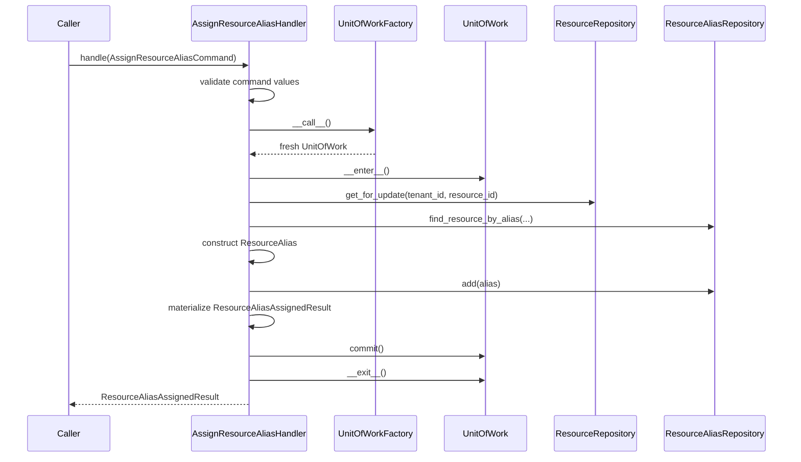

## Resource Merge Execution Command

`MergeResourceHandler` records one immutable `ResourceMerge` lineage edge from `source_resource_id` to `target_resource_id`. This use case is lineage-only: it does not migrate aliases, identifiers, ownerships, classifications, labels, relationships, state, or other resource facts; it does not archive, deactivate, delete, or rewrite either resource; and it does not resolve canonical resources.

`MergeResourceCommand` is an immutable transport-neutral dataclass with the actual fields required by the current `ResourceMerge` model: `tenant_id`, `source_resource_id`, `target_resource_id`, nullable `reason`, nullable `source`, and `merged_at`. `ResourceMergedResult` is fully materialized before commit and contains `merge_id`, `source_resource_id`, `target_resource_id`, `merged_at`, `reason`, and `source`.

Validation starts before a Unit of Work is created. The handler rejects command-only failures with `ValidationError("Invalid resource merge command", failures=(...))`: source and target must differ, `merged_at` must be timezone-aware, and nullable `reason` and `source` must not be blank when present. Direct self-merge is rejected in the application before PostgreSQL sees the row.

After command-only validation, the handler opens one fresh Unit of Work and locks both endpoint resources through `uow.resources.get_for_update(tenant_id, resource_id)`. Locks are acquired through the shared pure `_ordered_resource_ids(...)` helper, which returns stable UUID string order to prevent opposite-direction lock-order deadlock patterns. Physical lock order does not change source -> target merge direction: the persisted row always uses the command's source as `source_resource_id` and the command's target as `target_resource_id`. Missing and wrong-tenant endpoints raise `EntityNotFoundError("Resource not found", entity_type="Resource", lookup_field="source_resource_id" | "target_resource_id", lookup_value=...)` by semantic endpoint role, not physical lock order.

The source resource may have at most one outgoing merge. The handler checks `uow.resource_merges.get_outgoing_merge(tenant_id, source_resource_id)` and raises `ConflictError("Resource is already merged", entity_type="ResourceMerge", conflict_field="source_resource_id", conflict_value=source_resource_id)` before mutation when one exists. The target may already have its own outgoing merge. For example, `B -> C` followed by `A -> B` is valid and records the immediate requested target, producing `A -> B -> C`; the command does not rewrite `A -> C` or resolve the terminal canonical resource.

PostgreSQL remains authoritative for indirect cycle prevention through `prevent_resource_merge_cycle()` and `trg_resource_merge_prevent_cycle`. The application rejects direct self-merge, but it does not add recursive traversal, canonical resolution, path compression, or trigger-message parsing. Cycle-trigger failures that are not covered by the current persistence translator intentionally propagate as the original database error.

On success, the handler constructs exactly one `ResourceMerge`, adds it through `uow.resource_merges.add(...)`, materializes `ResourceMergedResult`, and calls `uow.commit()` exactly once as the final meaningful operation. It does not call `flush()` because merge ids are Python-generated and no server-generated fields are needed for the result. Commit-time persistence translation remains available for duplicate-source races through `uq_resource_merge_tenant_source_resource_id`.

Successful merge execution flow:

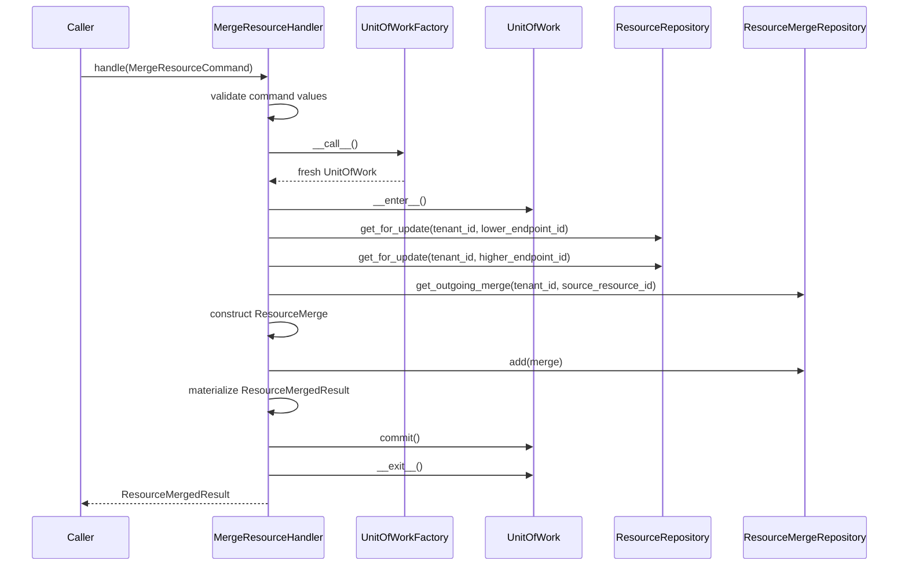

## Canonical Resource Resolution Query

`ResolveCanonicalResourceHandler` is the read-only application query for resolving one requested resource to the terminal canonical resource implied by `resource_merge` lineage. The query fields are exactly `tenant_id` and `resource_id`. The result fields are exactly `requested_resource_id`, `canonical_resource_id`, `immediate_target_resource_id`, `merge_depth`, `is_canonical`, and `canonical_resource`.

The handler opens one fresh Unit of Work, validates the requested resource with `uow.resources.get_by_id(tenant_id, resource_id)`, then follows direct outgoing edges through `uow.resource_merges.get_outgoing_merge(tenant_id, current_resource_id)`. After determining the terminal id, it loads the canonical resource with `uow.resources.get_by_id(tenant_id, canonical_resource_id)` and materializes a `ResourceReadResult`. It does not use `ResourceRepository.get_for_update(...)`, `ResourceMergeRepository.list_incoming_merges(...)`, recursive SQL, commits, repository mutation methods, path compression, lineage rewriting, resource fact migration, caching, or materialized canonical-id columns.

Resolution semantics are deterministic:

- `A` with no outgoing merge resolves to `A`, `immediate_target_resource_id=None`, `merge_depth=0`, and `is_canonical=True`.
- `A -> B` resolves to `B`, `immediate_target_resource_id=B`, `merge_depth=1`, and `is_canonical=False`.
- `A -> B -> C` resolves to `C`, `immediate_target_resource_id=B`, `merge_depth=2`, and `is_canonical=False`.
- Incoming branches such as `A -> C` and `B -> C` are irrelevant to resolving `C`; the query follows only the requested resource's outgoing chain.

Every lookup is tenant scoped. Wrong-tenant and absent requested resources raise `EntityNotFoundError("Resource not found", entity_type="Resource", lookup_field="resource_id", lookup_value=resource_id)` before merge traversal. If corrupt lineage points at a missing terminal resource despite database foreign-key expectations, the handler raises `ConflictError("Resource merge lineage target is missing", entity_type="ResourceMerge", conflict_field="target_resource_id", conflict_value=terminal_id)`.

The application includes defensive traversal guards even though PostgreSQL prevents normal cycles. Each handler invocation uses a local visited-id set and raises `ConflictError("Resource merge lineage contains a cycle", entity_type="ResourceMerge", conflict_field="lineage", conflict_value=requested_resource_id)` if a cycle is encountered. The maximum traversal depth is `MAX_RESOURCE_MERGE_DEPTH = 64`: a 64-edge chain is allowed, while the next edge lookup that would require traversing a 65th edge raises `ConflictError("Resource merge lineage exceeds maximum depth", entity_type="ResourceMerge", conflict_field="merge_depth", conflict_value=64)`.

Read-only flow:

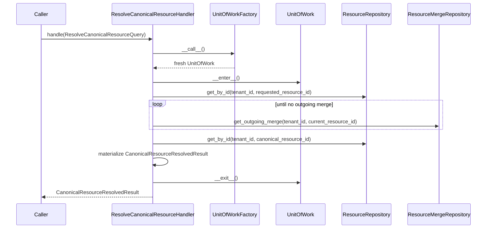

## Resource Classification Assignment Command

`AssignResourceClassificationHandler` appends one current `ResourceClassification` fact for an existing resource. This use case is assignment only: it does not replace classifications, expire classifications, transfer classifications, demote existing primary classifications, close current rows, delete history, create catalog rows, add API schemas, or introduce a generic temporal mutation abstraction.

`AssignResourceClassificationCommand` is an immutable transport-neutral dataclass with the actual fields required by the current `ResourceClassification` model: `tenant_id`, `resource_id`, `classification_type_id`, `classification_value_id`, `is_primary`, `confidence_score`, `valid_from`, and nullable `source`.

Validation starts before a Unit of Work is created. The handler rejects command-only failures with `ValidationError("Invalid resource classification assignment command", failures=(...))`: `confidence_score` must be between `0` and `1`; `valid_from` must be timezone-aware; and `source` may be `None` but must not be blank when provided.

After command-only validation, the handler opens one fresh Unit of Work and locks the tenant-scoped resource through `uow.resources.get_for_update(tenant_id, resource_id)`. Missing resources and wrong-tenant resources raise `EntityNotFoundError("Resource not found", entity_type="Resource", lookup_field="resource_id", lookup_value=resource_id)`. The handler performs no classification type lookup, classification value lookup, classification lookup, add, or commit after a resource miss.

The handler validates `ClassificationType` through `uow.classification_types.get_by_id(classification_type_id)`. Missing types raise `EntityNotFoundError`; inactive types raise `ConflictError`; neither path mutates classifications. Type rows are not created or reactivated by this command.

The handler validates `ClassificationValue` through `uow.classification_values.get_by_id(classification_value_id)`. Missing values raise `EntityNotFoundError`; inactive values raise `ConflictError`; neither path mutates classifications. The selected value must belong to the selected type by matching `classification_value.classification_type_id` to `command.classification_type_id`. A mismatch raises `ConflictError("ClassificationValue does not belong to ClassificationType", entity_type="ClassificationValue", conflict_field="classification_type_id", conflict_value=classification_type_id)` before classification reads or mutation.

Current duplicate checks use `uow.resource_classifications.find_current(tenant_id, resource_id, classification_type_id, classification_value_id)`. The schema-defined current value uniqueness is `tenant_id`, `resource_id`, and `classification_value_id`; the repository also accepts the materialized type id so callers prove the requested type/value pair consistently. If an equivalent current classification already exists, the handler raises `ConflictError("Resource classification is already assigned", entity_type="ResourceClassification", conflict_field="current", conflict_value=classification_value_id)` and creates no redundant history row.

Primary assignment uses the schema-defined scope: one current primary classification per `tenant_id`, `resource_id`, and `classification_type_id`. When `is_primary=True`, the handler calls `uow.resource_classifications.get_current_primary(tenant_id, resource_id, classification_type_id)`. An existing current primary raises `ConflictError("Resource classification primary already exists", entity_type="ResourceClassification", conflict_field="current_primary", conflict_value=classification_type_id)` before mutation. This issue deliberately does not implement primary replacement or silent demotion.

On success, the handler constructs exactly one `ResourceClassification` with `valid_from=command.valid_from` and `valid_to=None`, adds it through `uow.resource_classifications.add(...)`, materializes `ResourceClassificationAssignedResult`, and calls `uow.commit()` exactly once as the final meaningful operation. It does not call `flush()` because classification ids are Python-generated and no server-generated fields are needed for the result. After commit it does not access repositories, Unit of Work properties, entities, or lazy attributes. Failures propagate without explicit handler rollback; Unit of Work cleanup owns rollback and session closure. Commit-time persistence translation remains available for classification uniqueness races through `uq_resource_classification_current_value` and `uq_resource_classification_current_primary_type`.

Successful classification assignment flow:

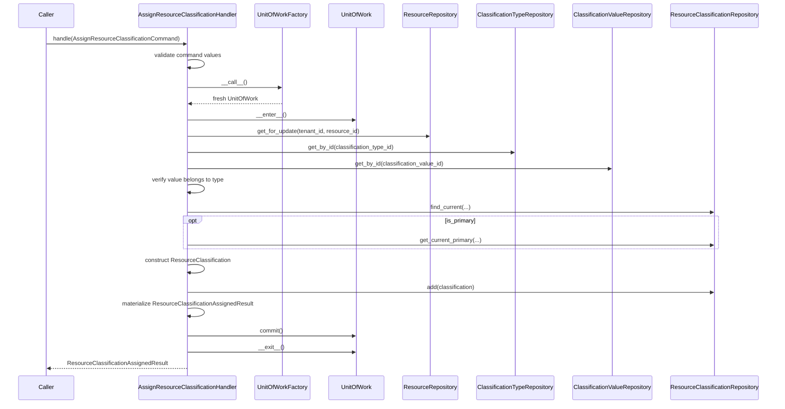

## Resource Label Assignment Command

`AssignResourceLabelHandler` appends one current `ResourceLabel` assignment for an existing resource and tenant-scoped label definition. This use case is assignment only: it does not create or update labels, normalize label key/value data, expire label assignments, replace assignments, enforce one value per key, add primary label semantics, propagate labels, add API schemas, or introduce a generic temporal mutation abstraction.

`AssignResourceLabelCommand` is an immutable transport-neutral dataclass with the actual fields required by the current `ResourceLabel` model: `tenant_id`, `resource_id`, `label_id`, `valid_from`, and nullable `source`. The command intentionally has no `is_primary`, `confidence_score`, `source_priority`, or classification fields because the mapped assignment table does not contain them.

Validation starts before a Unit of Work is created. The handler rejects command-only failures with `ValidationError("Invalid resource label assignment command", failures=(...))`: `valid_from` must be timezone-aware, and `source` may be `None` but must not be blank when provided. The accepted `source` value is preserved as provided.

After command-only validation, the handler opens one fresh Unit of Work and locks the tenant-scoped resource through `uow.resources.get_for_update(tenant_id, resource_id)`. Missing resources and wrong-tenant resources raise `EntityNotFoundError("Resource not found", entity_type="Resource", lookup_field="resource_id", lookup_value=resource_id)`. The handler performs no label lookup, assignment lookup, add, or commit after a resource miss.

The handler validates the target label through `uow.labels.get_by_id(tenant_id, label_id)`. Missing and wrong-tenant labels raise `EntityNotFoundError("Label not found", entity_type="Label", lookup_field="label_id", lookup_value=label_id)`. Because `Label` exposes `is_active` and current write paths reject inactive definitions, inactive labels raise `ConflictError("Label is inactive", entity_type="Label", conflict_field="label_id", conflict_value=label_id)`. The assignment command does not create, update, reactivate, normalize, or inspect label key/value fields.

Current duplicate checks use `uow.resource_labels.find_current(tenant_id, resource_id, label_id)`. If an equivalent current assignment already exists, the handler raises `ConflictError("Resource label is already assigned", entity_type="ResourceLabel", conflict_field="current", conflict_value=label_id)` and creates no redundant history row. The command deliberately does not implement one-label-value-per-key replacement, primary labels, or any classification-like cardinality rule; different labels may coexist on the same resource when the schema permits them, including different values for the same label key.

On success, the handler constructs exactly one `ResourceLabel` with `valid_from=command.valid_from` and `valid_to=None`, adds it through `uow.resource_labels.add(...)`, materializes `ResourceLabelAssignedResult`, and calls `uow.commit()` exactly once as the final meaningful operation. It does not call `flush()` because label assignment ids are Python-generated and no server-generated fields are needed for the result. After commit it does not access repositories, Unit of Work properties, entities, or lazy attributes. Failures propagate without explicit handler rollback; Unit of Work cleanup owns rollback and session closure. Commit-time persistence translation remains available for label-assignment uniqueness races through `uq_resource_label_current`.

Successful label assignment flow:

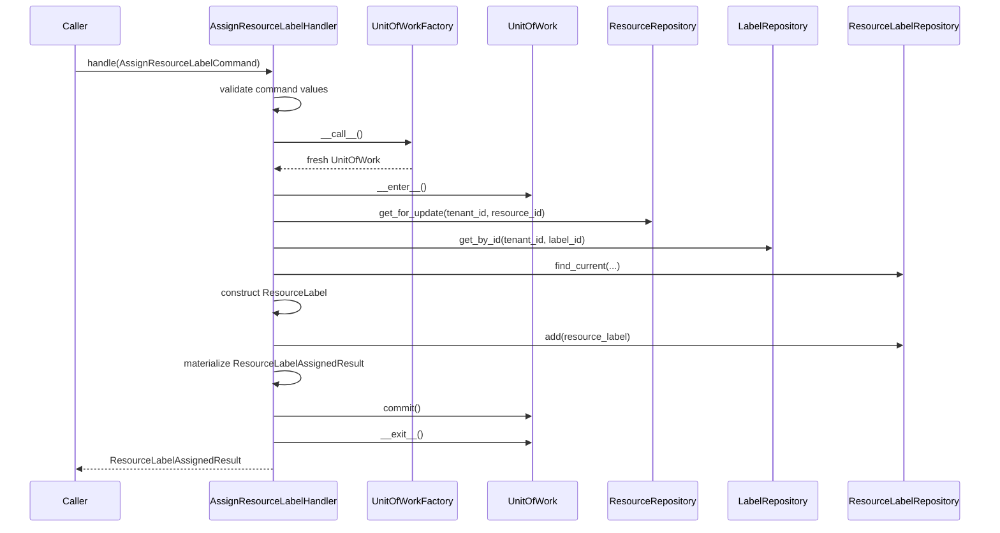

## Application Error Policy

Application code raises technology-neutral application errors:

- `ApplicationError`
- `EntityNotFoundError`
- `ConflictError`
- `ValidationError`
- `ConcurrentModificationError`
- `TenantBoundaryError`
- `PersistenceError`

`ValidationError` may carry immutable `ValidationFailure` details. `ConflictError` may carry technology-neutral conflict metadata including `entity_type`, `conflict_field`, `conflict_value`, and a stable `constraint` name when a persistence adapter recognizes a named database invariant. Application errors do not carry HTTP status codes, FastAPI exceptions, Pydantic validation objects, SQLAlchemy exceptions, driver exceptions, SQL text, database URLs, credentials, or raw driver objects.

## Handler Transaction Flow

Command handlers use one Unit of Work, validate first, commit last, and rely on context-manager rollback for all unsuccessful paths:

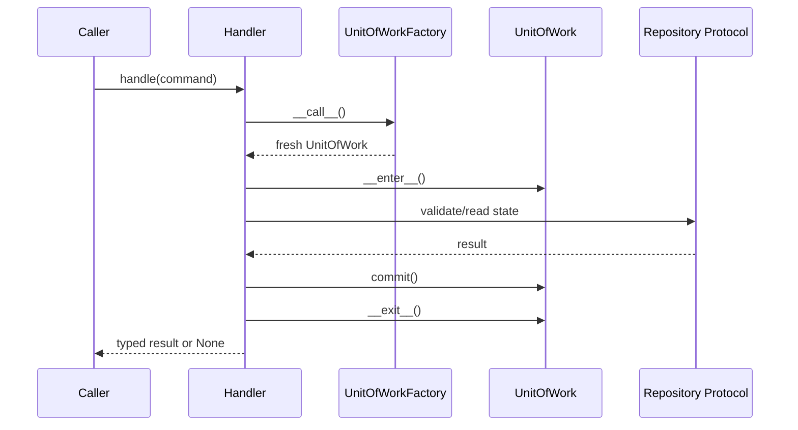

Query handlers use one Unit of Work and never commit:

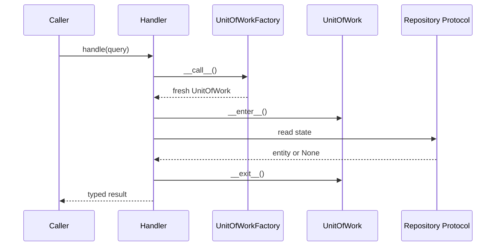

## Unit of Work Semantics

The application-facing Unit of Work supports:

```python
with unit_of_work:
    tenant = unit_of_work.tenants.get_by_slug("example")
    if tenant is not None:
        resource = unit_of_work.resources.get_by_canonical_name(
            tenant.id,
            "example.com",
        )
        unit_of_work.commit()
```

Entering the context opens one session and transaction. Multiple repositories exposed by the Unit of Work share that same session and transaction. `commit()` is explicit and owned by the Unit of Work. `rollback()` is explicit and may be called by the application when needed.

On exception, the Unit of Work rolls back and closes the session. When the context exits without an explicit successful commit, it also rolls back and closes the session. After a failed flush or commit, the Unit of Work is considered failed; callers should roll back, exit the context, and start a new Unit of Work. Repository instances are scoped to one Unit of Work lifetime and must not be reused after the Unit of Work closes.

The concrete SQLAlchemy implementation is single-use and follows explicit lifecycle states: `new`, `active`, `committed`, `rolled_back`, `failed`, and `closed`. It rejects commit, rollback, or session access before `__enter__`; rejects entering an already active instance; rejects reuse after closure; rejects a second commit; rejects rollback after commit; and rejects commit after rollback or failed transaction. Cleanup rollback is safe and repeated explicit rollback is idempotent while the Unit of Work is still open.

The concrete `session` property is infrastructure-facing and available only while the Unit of Work is active. It is not part of the application-facing `UnitOfWork` protocol. SQLAlchemy repositories attached to one Unit of Work receive this exact session instance and must never call `commit()`.

`SQLAlchemyUnitOfWork` accepts an injectable synchronous session factory. Production wiring uses the shared `SessionLocal` configured from the application engine. Tests inject their own isolated `sessionmaker` bound to the test engine. A Unit of Work creates exactly one session from the factory, closes that session on exit, and does not dispose the shared engine.

`SQLAlchemyUnitOfWork` constructs `SQLAlchemyTenantRepository`, `SQLAlchemyOrganizationRepository`, `SQLAlchemyLabelRepository`, `SQLAlchemyResourceRepository`, one `SQLAlchemyManagedCatalogRepository` per global managed catalog, one `SQLAlchemyClassificationValueRepository`, all temporal fact repositories, `SQLAlchemyResourceAliasRepository`, `SQLAlchemyResourceMergeRepository`, and `SQLAlchemyResourceQueryService` when `__enter__()` opens the session. `uow.tenants`, `uow.organizations`, `uow.labels`, `uow.resources`, `uow.resource_types`, `uow.identifier_types`, `uow.relationship_types`, `uow.ownership_roles`, `uow.classification_types`, `uow.classification_values`, `uow.lifecycle_statuses`, `uow.criticalities`, `uow.exposure_levels`, `uow.resource_identifiers`, `uow.resource_ownerships`, `uow.resource_relationships`, `uow.resource_classifications`, `uow.resource_labels`, `uow.resource_states`, `uow.resource_aliases`, `uow.resource_merges`, and `uow.resource_queries` are available only while the Unit of Work is active, share the same session, and are cleared on exit. SQLAlchemy repositories and query services may also be constructed directly with an active session for focused tests or low-level integration. They do not create sessions, engines, nested transactions, or repository-owned transaction boundaries. Repository and query-service instances are scoped to that Unit of Work lifetime and are not safe to reuse after the Unit of Work closes.

Catalog lookup remains read-only at the application boundary:

```python
with SQLAlchemyUnitOfWork() as uow:
    resource_type = uow.resource_types.get_by_code("domain")
    lifecycle = uow.lifecycle_statuses.get_by_code("active")
    values = uow.classification_values.list_active_for_type(
        classification_type_id,
    )
```

Temporal fact reads use the same Unit of Work session and explicit tenant scope:

```python
with SQLAlchemyUnitOfWork() as uow:
    current_state = uow.resource_states.get_current(
        tenant_id,
        resource_id,
    )
    history = uow.resource_states.list_history(
        tenant_id,
        resource_id,
    )
```

Alias and merge lineage reads use direct lookup semantics only:

```python
with SQLAlchemyUnitOfWork() as uow:
    resource = uow.resource_aliases.find_resource_by_alias(
        tenant_id,
        "dns_name",
        "example.com",
    )
    outgoing_merge = uow.resource_merges.get_outgoing_merge(
        tenant_id,
        source_resource_id,
    )
```

Alias assignment uses the same direct alias lookup contract to reject duplicates and collisions before insert. It does not add canonical merge traversal or alias transfer behavior.

Merge execution uses only direct outgoing merge lookup and incoming merge read-back. It records immediate requested lineage edges and does not add recursive canonical traversal. Canonical Resource resolution is a separate read-only query that follows direct outgoing merge edges through the same tenant-scoped repository method and does not rewrite lineage.

## Transaction Ownership

One application command or use case normally owns one Unit of Work. Application handlers obtain that Unit of Work by calling an injected `UnitOfWorkFactory`. Application services decide whether the operation succeeds. Repositories never commit and helper functions must not hide commits. External network calls should not normally run inside an open database transaction.

Repository `add(...)`, lookup helpers, refresh helpers, and locking helpers never commit, roll back, close a session, dispose an engine, retry a failed transaction, or translate SQLAlchemy/database exceptions. A failed flush remains the Unit of Work's failed transaction; cleanup is handled by `SQLAlchemyUnitOfWork` rollback-on-exit or an explicit Unit of Work rollback. Repositories may flush only when the concrete operation requires generated/default values, early constraint validation, or subsequent dependent writes, and no helper commits after flushing.

Command handlers call `commit()` exactly once, after successful validation and repository interaction, and perform no repository operations after commit. Query handlers never call `commit()` and return typed result contracts rather than lazy session-bound query objects. Read-only query services may later use a separate controlled session pattern. SQLAlchemy and PostgreSQL errors are translated at the persistence boundary. Retry behavior for deadlocks or serialization failures must be explicit at the application orchestration level and must not be hidden inside repositories.

`AssignResourceRelationshipHandler` and `MergeResourceHandler` are the only current dual-Resource write handlers. Both use the same deterministic `_ordered_resource_ids(...)` helper for physical lock order while preserving the semantic command roles in validation errors and persisted rows. Single-Resource mutation handlers lock only the requested tenant-owned Resource. Read handlers and canonical resolution do not take write locks.

The existing `get_session()` helper remains available for lower-level framework integration. The existing `transaction_session()` helper remains for current low-level scripts or compatibility paths, but it is not the application-core transaction abstraction. New application command workflows should receive Unit of Work instances through `UnitOfWorkFactory`; outer infrastructure wiring may provide `SQLAlchemyUnitOfWork` behind that protocol.

## Tenant-Safety Rules

Tenant-owned repository methods require explicit tenant context. Lookups by entity id alone are prohibited for tenant-owned entities. There is no optional, ambient, or implicit tenant scope for normal application operations.

SQLAlchemy implementations must apply tenant predicates even when PostgreSQL composite foreign keys also enforce integrity. Cross-tenant misses return the same application-facing result as absent rows. Future global administrative access must use separate explicit contracts. Every future concrete repository issue must include tenant-isolation tests.

Tenant-scoped repository infrastructure requires explicit `tenant_id` for tenant-owned statement construction and entity lookup. The shared `tenant_select(...)` and `tenant_entity_select(...)` helpers centralize the tenant predicate; tenant-owned id lookup always includes both `tenant_id` and entity `id`. There is no `tenant_id=None` default, no ambient tenant scope, no `ignore_tenant` bypass flag, and no unscoped fallback helper on the tenant-scoped base. Global catalog repositories use `entity_select(...)` for primary-key lookup and direct SQLAlchemy 2.x statements for code and active-list lookups without tenant-scoped infrastructure.

All current managed catalog models use `code` and `is_active`; none define `sort_order`. Active-list methods therefore filter on `is_active IS true` and order by `code, id`. Classification-value active lists also filter by `classification_type_id`, exclude values from other types, and use the same `code, id` ordering within the type. Seeded rows are read through these repositories by their deterministic codes and UUIDs; the adapters do not duplicate seed data, alter seed codes, or expose catalog mutation.

Temporal fact repositories use `TenantScopedSQLAlchemyRepository` and the schema's current-row predicate, `valid_to IS NULL`. Current methods apply tenant scope plus their exact resource, value, role, type, label, or endpoint predicates and never load all history for Python-side filtering. Identifier lookup includes exact current value lookup and current primary lookup for the schema-defined `tenant_id`, `resource_id`, and `identifier_type_id` primary scope. Ownership lookup includes exact current resource/organization/role lookup and current primary lookup for the schema-defined `tenant_id`, `resource_id`, and `ownership_role_id` primary scope. Relationship lookup includes exact current directed source/type/target lookup for the schema-defined `tenant_id`, `source_resource_id`, `target_resource_id`, and `relationship_type_id` uniqueness scope. Classification lookup includes exact current resource/type/value lookup and current primary lookup for the schema-defined `tenant_id`, `resource_id`, and `classification_type_id` primary scope. Label assignment lookup includes exact current resource/label lookup for the schema-defined `tenant_id`, `resource_id`, and `label_id` uniqueness scope. State history uses the contract's only current history method and returns closed and current rows ordered by `valid_from, id`; other temporal contracts do not currently expose history methods. Current collection ordering is deterministic: identifiers by `identifier_type_id, namespace, normalized_value, id`; ownership by `ownership_role_id, is_primary DESC, organization_id, id`; outgoing relationships by `relationship_type_id, target_resource_id, id`; incoming relationships by `relationship_type_id, source_resource_id, id`; classifications by `classification_type_id, classification_value_id, id`; labels by `label_id, id`.

Temporal adapters are append/read only. `add(...)` attaches the new fact to the active Unit of Work session and does not flush automatically. Repositories do not close prior current rows, rewrite or delete history, validate state transitions, traverse organization hierarchies, resolve relationship graphs, create labels, mutate catalogs, translate database errors, or retry failed transactions. PostgreSQL constraints remain the source of truth for one-current-row rules, temporal interval validity, tenant-consistent resource references, relationship endpoint validity, classification type/value integrity, label assignment integrity, and original `IntegrityError` propagation.

Lineage adapters are append/read only. `SQLAlchemyResourceAliasRepository.find_resource_by_alias(tenant_id, alias_type, normalized_value)` performs an exact tenant-scoped match on the string alias type and normalized value, then returns the directly referenced `Resource` through a tenant-safe join. It does not normalize input, search identifiers, follow merge chains, resolve canonical resources, or apply fallback matching. `list_for_resource(...)` returns aliases for the direct resource ordered by `alias_type, normalized_value, id`.

`SQLAlchemyResourceMergeRepository.get_outgoing_merge(tenant_id, source_resource_id)` returns the direct outgoing merge edge for a source resource, if present. `list_incoming_merges(tenant_id, target_resource_id)` returns direct incoming edges ordered by `merged_at, id`. The adapter does not execute merges, transfer aliases or facts, update resource snapshots, recursively traverse lineage, materialize canonical ids, translate errors, or retry failed writes. PostgreSQL remains the source of truth for alias uniqueness, tenant-consistent resource references, alias seen-window checks, merge source and target references, self-merge rejection, one outgoing merge per source, merge cycle prevention, and original database exception propagation.

`SQLAlchemyOrganizationRepository` applies tenant scope to every read: id lookup, canonical-name lookup, external-key lookup, existence checks, and direct-child listing. Cross-tenant misses return the same `None`, `False`, or empty sequence shape as ordinary misses. Direct children are ordered by `canonical_name` and `id` so callers never rely on unspecified database row order.

`SQLAlchemyResourceRepository` applies tenant scope to every read: id lookup, canonical-name lookup, existence checks, and explicit `get_for_update(...)` locking lookup. Normal `get_by_id(...)` does not lock rows; `get_for_update(...)` applies the tenant predicate before wrapping the statement with `FOR UPDATE`, and the lock remains owned by the active Unit of Work transaction. Resource canonical names are indexed by tenant but are not currently unique, so direct canonical-name lookup uses deterministic `canonical_name, id` ordering and does not fall back to aliases, identifiers, or merge lineage.

## ORM Mapped-Entity Policy

Existing SQLAlchemy mapped entities may initially serve as the entity representation used by application services, but SQLAlchemy `Session` and query APIs must not cross into the application layer.

This avoids duplicating the complete Resource Inventory model before repository behavior proves a need for separate pure domain entities. The trade-off is controlled coupling to mapped attributes and relationship behavior. Separate domain entities may be justified later if application logic needs persistence-independent invariants, non-SQLAlchemy execution, richer aggregate encapsulation, or a second storage technology. Until then, duplicating every mapped Resource Inventory entity would add churn without reducing a proven risk.

## Persistence Error Boundary

Application code raises application-facing errors:

- `ApplicationError`
- `EntityNotFoundError`
- `ConflictError`
- `ValidationError`
- `ConcurrentModificationError`
- `TenantBoundaryError`
- `PersistenceError`

The persistence error boundary is:

```text
Application Handler
    ↓
UnitOfWork.commit()
    ↓
SQLAlchemy/PostgreSQL
    ↓
Persistence translator
    ↓
Technology-neutral ApplicationError
```

`app.persistence.sqlalchemy.errors` translates known SQLAlchemy and PostgreSQL commit failures into existing technology-neutral application errors. The translator lives entirely inside the SQLAlchemy persistence adapter; application handlers and application ports do not import it. Repositories remain transaction-neutral and do not translate errors, commit, roll back, retry, or query the database to reconstruct conflict metadata.

Translation uses stable metadata only: SQLAlchemy exception type, PostgreSQL SQLSTATE, and PostgreSQL constraint name. It never parses human-readable PostgreSQL error messages, localized driver text, SQL text, or DBAPI string representations. Mapped unique-constraint violations with SQLSTATE `23505` become `ConflictError` only when their exact named constraint is present in the explicit mapping. Unknown or unmapped persistence errors continue to propagate as their original SQLAlchemy/database exceptions.

Translated errors preserve the original persistence exception through exception chaining: `raise translated from exc`. `StaleDataError` from SQLAlchemy optimistic version checks maps to `ConcurrentModificationError("Resource was modified concurrently", entity_type="Resource", conflict_field="record_version")` and preserves the original `StaleDataError` as `__cause__`.

No retry behavior is introduced for deadlocks, serialization failures, optimistic conflicts, or uniqueness conflicts. Future transport code may map application errors to HTTP responses, but HTTP status mapping remains outside the persistence boundary.

## Relationship-Loading Rules

Lazy loading must not unexpectedly occur outside an active Unit of Work. Repository methods define the relationship loading needed by each use case. They do not load the entire Resource graph by default and do not apply blanket eager loading. Read-heavy use cases should prefer projections or query services.

Critical query paths should later include query-count or SQL-shape tests. `SELECT ... FOR UPDATE` is reserved for explicit concurrent mutation workflows. Hidden refresh or expiration behavior must not be relied on without documentation.

The shared loading helper only applies explicit SQLAlchemy loader options chosen by a concrete repository. It does not implement blanket eager loading, an include/expand framework, or global relationship-loading mutation. The locking helper only wraps a prepared statement with `with_for_update()` when a concrete repository asks for pessimistic locking; normal reads are not locked automatically, and no advisory locks, retry loops, deadlock handling, or lock timeout policy are introduced here.

`Resource` is currently the only mapped entity with SQLAlchemy optimistic concurrency enabled through `record_version` and `version_id_col`. Shared repository infrastructure preserves SQLAlchemy's normal version-check behavior and does not disable version checks or define a generic version-column convention for all models. `SQLAlchemyUnitOfWork.commit()` translates `StaleDataError` raised by this version check into `ConcurrentModificationError`.

## Write/Read Separation

Repositories support transactional entity and aggregate mutation workflows. Query services support projections, filtering, history, search, and pagination. Query services must enforce tenant scope. Large resource collections should prefer keyset or cursor pagination over deep offset pagination.

This is not a CQRS framework. This stage does not introduce a separate read database, event bus, or outbox.

## Resource Query Service and Pagination

Stage `03.2` introduces the Resource collection query boundary without widening `ResourceRepository`; Stage `03.3.1` extends the same boundary with the explicit Resource details read method; Stage `03.3.2` adds the explicit Resource temporal history read method. The repository remains narrow and transactional: id lookup, canonical-name lookup, existence checks, explicit lock lookup, and add/flush-style persistence operations. It must not grow list, search, filter, paginate, sort, history, timeline, or generic query-spec methods. Collection, details, and history reads use the dedicated application port `ResourceQueryService`, exposed inside the active Unit of Work as `uow.resource_queries`.

`ListResourcesQuery` is a frozen application query with `tenant_id`, optional `resource_type_id`, optional `lifecycle_status_id`, optional `organization_id`, optional `label_id`, optional `classification_type_id`, optional `classification_value_id`, `page_size`, and optional opaque `cursor`. `organization_id` means exact organization referenced by the Resource's current primary `owner` `ResourceOwnership` row. Historical ownership rows, current non-primary rows, and current primary rows for other ownership roles do not satisfy the organization filter. `label_id` means the Resource has a current tenant-scoped `ResourceLabel` assignment for exactly that label id; historical assignments do not match and no label key/value search is performed. `classification_type_id` alone means any current `ResourceClassification` row of that type. `classification_type_id` plus `classification_value_id` means the exact current type/value pair. Current non-primary classifications are eligible. A `classification_value_id` without `classification_type_id` is rejected by `ListResourcesHandler` validation before a Unit of Work is opened. Nonexistent filter ids and valid but unmatched combinations return empty pages. There is no organization hierarchy expansion, ancestor/descendant traversal, list-of-organization ids, multi-label filtering, OR/NOT syntax, facets, full-text search, or generic filters dictionary.

`ResourceSummaryResult` is an immutable, entity-free projection containing `resource_id`, `tenant_id`, `resource_type_id`, `lifecycle_status_id`, `canonical_name`, `display_name`, nullable `primary_organization_id`, nullable `primary_ownership_role_id`, `record_version`, `first_seen_at`, `last_seen_at`, `created_at`, and `updated_at`. The ownership fields are scalar ids from the current primary `owner` row only; no `ResourceOwnership` entity or history collection crosses the application boundary. `ResourcePageResult` contains `items`, `next_cursor`, and `page_size`; it deliberately does not include `total_count`.

The page-size contract is explicit: minimum `1`, default `50`, and maximum `200`. Invalid page sizes and structurally invalid classification value-only filters fail in `ListResourcesHandler` before a Unit of Work is created. The handler opens one fresh Unit of Work, decodes the cursor, calls only `uow.resource_queries.list_resources(...)`, materializes immutable result DTOs before exit, and never commits, rolls back explicitly, flushes, mutates resources, or takes write locks.

Ordering is stable and technology-neutral at the application boundary: `resource.created_at ASC, resource.id ASC`. Pagination is keyset based. Cursor version `1` is URL-safe base64 JSON containing only the last returned tuple position: `{"v":1,"created_at":"...","id":"..."}`. Decoding requires a valid version, timezone-aware ISO datetime, UUID id, and no extra fields. The continuation predicate is:

```sql
resource.created_at > :cursor_created_at
OR (
    resource.created_at = :cursor_created_at
    AND resource.id > :cursor_resource_id
)
```

The SQLAlchemy adapter lives below the persistence boundary at `app.persistence.sqlalchemy.queries.resources.SQLAlchemyResourceQueryService`. It issues one projection query against `resource`, left-joins the current primary `owner` `resource_ownership` row, selects only summary and ownership scalar columns, applies mandatory `tenant_id` plus optional exact `resource_type_id`, `lifecycle_status_id`, `organization_id`, `label_id`, `classification_type_id`, and `classification_value_id` filters, orders by the keyset tuple, and requests `limit + 1` rows to determine whether a next page exists. The ownership join predicate is `resource_ownership.tenant_id = resource.tenant_id`, `resource_ownership.tenant_id = :tenant_id`, `resource_ownership.resource_id = resource.id`, `resource_ownership.ownership_role_id = owner-role-id`, `resource_ownership.is_primary IS true`, and `resource_ownership.valid_to IS NULL`. The seeded `owner` role disambiguates the schema's per-role current-primary uniqueness so the join remains one row per Resource without `DISTINCT`.

The label and classification filters are correlated `EXISTS` predicates rather than joins. The label predicate is tenant-scoped and current-only: `resource_label.tenant_id = :tenant_id`, `resource_label.tenant_id = resource.tenant_id`, `resource_label.resource_id = resource.id`, `resource_label.label_id = :label_id`, and `resource_label.valid_to IS NULL`. The classification predicate is also tenant-scoped and current-only: `resource_classification.tenant_id = :tenant_id`, `resource_classification.tenant_id = resource.tenant_id`, `resource_classification.resource_id = resource.id`, `resource_classification.classification_type_id = :classification_type_id`, `resource_classification.valid_to IS NULL`, and, when supplied, `resource_classification.classification_value_id = :classification_value_id`.

When `organization_id` is absent, Resources without a current primary owner remain visible and their ownership projection fields are `None`. When `organization_id` is present, Resources without a matching current primary owner do not match. Resource type, lifecycle status, organization, label, and classification filters combine with `AND`.

The adapter returns the next cursor position from the last returned item, not from the extra probe row. It does not use `OFFSET`, `COUNT(*)`, `DISTINCT`, arbitrary sorting, generic query specifications, caches, relationship loading, entity mutation, flush, commit, rollback, or retry logic. The `EXISTS` predicates preserve one Resource row per result even when a Resource has many current labels or classifications; no application-side deduplication is required. It does not perform per-Resource ownership, label, classification, or catalog lookups, so there is no N+1 enrichment path.

Tenant isolation is enforced by the SQL predicate on every page request. The cursor intentionally carries no tenant id or filter state, so changing tenant or filters between requests never leaks rows from the cursor's original tenant; it simply applies the supplied tenant/filter predicates plus the decoded tuple position. The cursor is a stable position marker, not a cross-request snapshot guarantee. Concurrent inserts before the cursor may be skipped by a later page, inserts after the cursor may appear, and updates to ordering columns are outside this stage's stronger consistency guarantees.

The current schema already has tenant/filter indexes such as tenant plus resource type, tenant plus lifecycle status, ownership tenant plus resource, ownership tenant plus organization, ownership tenant plus role, ownership tenant plus validity, ownership tenant/resource/role, and partial ownership uniqueness for current rows and current-primary rows. ResourceLabel indexes are `ix_resource_label_tenant_resource_label`, `ix_resource_label_tenant_label_id`, `ix_resource_label_tenant_valid_to`, and partial unique `uq_resource_label_current`. ResourceClassification indexes are `ix_resource_classification_tenant_resource_value`, `ix_resource_classification_tenant_resource_type`, `ix_resource_classification_tenant_value`, `ix_resource_classification_tenant_type_value`, `ix_resource_classification_tenant_valid_to`, partial unique `uq_resource_classification_current_value`, and partial unique `uq_resource_classification_current_primary_type`. The schema does not yet define a composite `(tenant_id, created_at, id)` index for the default keyset order, a partial label filter index such as `(tenant_id, label_id, resource_id) WHERE valid_to IS NULL`, a partial classification filter index such as `(tenant_id, classification_type_id, classification_value_id, resource_id) WHERE valid_to IS NULL`, or a partial ownership index tuned to organization-filtered current-primary owner lookup such as `(tenant_id, organization_id, resource_id) WHERE valid_to IS NULL AND is_primary = true AND ownership_role_id = owner-role-id`. Correctness does not depend on those indexes, but high-volume collection reads should add follow-up migrations after access patterns are confirmed.

## Resource Exact Identity Lookup

Stage `03.2.3` adds exact Resource lookup through `ResourceQueryService` without adding search methods to `ResourceRepository`. `FindResourceByIdentifierQuery` is a frozen application query with `tenant_id`, `identifier_type_id`, `namespace`, and `normalized_value`. `FindResourceByAliasQuery` is a frozen application query with `tenant_id`, `alias_type`, and `normalized_value`. Both handlers validate blank string inputs before opening a Unit of Work, preserve accepted values exactly, and do not trim, lowercase, normalize, parse, or hash caller input.

Identifier lookup matches only the exact current `ResourceIdentifier` identity inside the requested tenant: `tenant_id`, `identifier_type_id`, exact namespace predicate, exact `normalized_value`, and `valid_to IS NULL`. For `namespace=None`, lookup uses `namespace IS NULL`; for a non-null namespace, lookup uses exact equality. Historical identifiers do not participate. Current non-primary identifiers remain eligible because `is_primary` is projection metadata, not lookup eligibility. Matching uses stored `normalized_value`, not `original_value`; `value_hash` is not used because this stage has no reusable hash-generation helper and the query still compares full normalized value.

Alias lookup matches only the exact tenant-local `ResourceAlias` key: `tenant_id`, `alias_type`, and `normalized_value`. `alias_value` is evidence/display data and is not used for matching. No fuzzy operator, `ILIKE`, wildcard, prefix, regular expression, full-text search, generic identity resolver, or OR-across-identities workflow is introduced.

`ResourceIdentifierLookupResult` contains a `ResourceReadResult` for the directly matched stored Resource plus `identifier_id`, `identifier_type_id`, `namespace`, `normalized_value`, `original_value`, and `is_primary`. `ResourceAliasLookupResult` contains a `ResourceReadResult` plus `alias_id`, `alias_type`, `normalized_value`, and `alias_value`. No ORM Resource, ResourceIdentifier, ResourceAlias, SQLAlchemy row, or session-bound object crosses the application boundary.

The SQLAlchemy adapter implements each lookup as one scalar projection query joining the identity row to `resource` with explicit tenant equality on both sides. It uses singular `one_or_none()` semantics so normal database uniqueness returns zero or one row and duplicate corruption is not hidden by `LIMIT 1`. The handler translates a missing projection into `EntityNotFoundError`; wrong-tenant and absent identities are indistinguishable. The handlers are read-only: no commit, rollback, lock, mutation, retry, nested Unit of Work, or second Resource lookup occurs.

Identity lookup returns the Resource directly referenced by the matched stored identity row. It does not follow `resource_merge` lineage, compress paths, or expose a `resolve_canonical` flag. Canonical Resource resolution remains the separate `ResolveCanonicalResourceQuery` workflow.

Relevant identifier indexes are `ix_resource_identifier_tenant_id_resource_id`, `ix_res_ident_tenant_type_hash`, `ix_res_ident_tenant_type_normalized`, `ix_resource_identifier_tenant_id_valid_to`, `uq_resource_identifier_current_value`, and `uq_resource_identifier_current_primary`. Relevant alias indexes are `uq_resource_alias_tenant_alias_type_normalized_value`, `ix_resource_alias_tenant_resource_id`, `ix_resource_alias_tenant_alias_type`, and `ix_resource_alias_tenant_last_seen_at`. Exact lookups are supported for correctness by existing unique/indexed tenant-local keys; a future performance migration could add an identifier current exact lookup index that includes namespace and `valid_to IS NULL` if measured workloads need it.

Stage `03.2.5` closes the Resource query-service baseline without adding a new query capability. Stage `03.3.1` then adds the Resource details read model as the next explicit query-service method. Stage `03.3.2` adds the Resource temporal history read model as a separate method instead of adding history flags to details. Stage `03.3.3` adds the direct one-hop relationship read model as another separate method instead of adding relationship expansion flags to details or history. The audited workflow inventory is:

| Workflow | Query | Handler | Query-service method | Result |
| --- | --- | --- | --- | --- |
| Resource list page | `ListResourcesQuery` | `ListResourcesHandler` | `list_resources(...)` | `ResourcePageResult` of `ResourceSummaryResult` |
| Exact current identifier lookup | `FindResourceByIdentifierQuery` | `FindResourceByIdentifierHandler` | `find_by_identifier(...)` | `ResourceIdentifierLookupResult` |
| Exact alias lookup | `FindResourceByAliasQuery` | `FindResourceByAliasHandler` | `find_by_alias(...)` | `ResourceAliasLookupResult` |
| Resource details by id | `GetResourceDetailsQuery` | `GetResourceDetailsHandler` | `get_resource_details(...)` | `ResourceDetailsResult` |
| Resource temporal history by id | `GetResourceHistoryQuery` | `GetResourceHistoryHandler` | `get_resource_history(...)` | `ResourceHistoryResult` |
| Resource direct relationships by id | `GetResourceRelationshipsQuery` | `GetResourceRelationshipsHandler` | `get_resource_relationships(...)` | `ResourceRelationshipsResult` |

The hardening audit found no production-code correctness defects in Stage `03.2`. The hardening changes were regression and documentation safeguards: combined-filter stable-dataset pagination coverage across three pages, exact identifier and alias lookup checks after list results leave the Unit of Work, canonical-resolution separation coverage, ResourceQueryService surface checks, no list-filter catalog lookup checks, and identity-handler no-auto-canonicalization checks. Resource listing remains cursor-v1 keyset paginated using `created_at ASC, id ASC`, with no `OFFSET` and no exact total count. Current organization, label, and classification filters retain their established temporal semantics, and Resource identity lookups remain exact, tenant-scoped, read-only, and non-canonicalizing.

Index readiness after Stage `03.2`:

| Query path | Existing indexes | Coverage | Follow-up recommendation |
| --- | --- | --- | --- |
| Resource list ordering | `ix_resource_tenant_id_resource_type_id`, `ix_resource_tenant_id_lifecycle_status_id`; no `(tenant_id, created_at, id)` index | Correctness is covered by tenant predicate plus keyset ordering; large ordered scans may need more support | Add `(tenant_id, created_at, id)` when measured list volume requires it |
| Current primary owner filter/projection | `ix_resource_ownership_tenant_id_resource_id`, `ix_resource_ownership_tenant_id_organization_id`, `ix_resource_ownership_tenant_id_ownership_role_id`, `ix_resource_ownership_tenant_id_valid_to`, `ix_resource_ownership_tenant_resource_role`, `uq_resource_ownership_current`, `uq_resource_ownership_current_primary` | Correctness and current-primary uniqueness are covered; organization-filtered current-primary lookup is not covered by one ideal partial index | Consider `(tenant_id, organization_id, resource_id) WHERE valid_to IS NULL AND is_primary = true AND ownership_role_id = owner-role-id` |
| Current label filter | `ix_resource_label_tenant_resource_label`, `ix_resource_label_tenant_label_id`, `ix_resource_label_tenant_valid_to`, `uq_resource_label_current` | Correctness and current uniqueness are covered; current label reverse lookup may combine predicates across indexes | Consider `(tenant_id, label_id, resource_id) WHERE valid_to IS NULL` |
| Current classification filter | `ix_resource_classification_tenant_resource_value`, `ix_resource_classification_tenant_resource_type`, `ix_resource_classification_tenant_value`, `ix_resource_classification_tenant_type_value`, `ix_resource_classification_tenant_valid_to`, `uq_resource_classification_current_value`, `uq_resource_classification_current_primary_type` | Correctness and current uniqueness are covered; type/value current filter may benefit from a partial covering order | Consider `(tenant_id, classification_type_id, classification_value_id, resource_id) WHERE valid_to IS NULL` |
| Current identifier lookup | `ix_resource_identifier_tenant_id_resource_id`, `ix_res_ident_tenant_type_hash`, `ix_res_ident_tenant_type_normalized`, `ix_resource_identifier_tenant_id_valid_to`, `uq_resource_identifier_current_value`, `uq_resource_identifier_current_primary` | Current exact tenant/type/namespace/normalized-value uniqueness is covered; query intentionally compares full normalized value and does not use `value_hash` | Consider an explicit current exact lookup index including namespace if measured workloads need it |
| Alias lookup | `uq_resource_alias_tenant_alias_type_normalized_value`, `ix_resource_alias_tenant_resource_id`, `ix_resource_alias_tenant_alias_type`, `ix_resource_alias_tenant_last_seen_at` | Exact tenant/alias-type/normalized-value lookup is covered by unique constraint | No immediate follow-up |

Final Block 03 index/access-path closeout:

| Query path | Existing indexes | Predicate/order coverage | Follow-up recommendation |
| --- | --- | --- | --- |
| Resource details child reads | Current state, ownership, label, classification, identifier, alias, and merge indexes listed above plus `uq_resource_tenant_id_id` | Fixed six-SELECT details plan is tenant/resource anchored and avoids one-to-many cartesian multiplication | Add partial current tenant/resource covering indexes only after measuring details read pressure |
| Resource history reads | `ix_resource_state_tenant_resource_valid_from`, `ix_resource_ownership_tenant_id_resource_id`, `ix_resource_ownership_tenant_resource_role`, `ix_resource_label_tenant_resource_label`, `ix_resource_classification_tenant_resource_value`, `ix_resource_classification_tenant_resource_type`, `ix_resource_identifier_tenant_id_resource_id` | Tenant/resource predicates are covered for correctness; chronological ordering may still sort within a resource's history | Consider `(tenant_id, resource_id, valid_from, id)` per temporal fact table after measuring history workloads |
| Resource relationship source/target reads | `ix_resource_relationship_tenant_id_source_resource_id`, `ix_resource_relationship_tenant_source_type`, `ix_resource_relationship_tenant_id_target_resource_id`, `ix_resource_relationship_tenant_target_type`, `ix_resource_relationship_tenant_id_valid_to`, `uq_resource_relationship_current` | Current one-hop OR query has tenant-aware source and target access paths | Consider partial current source/target indexes only after measuring relationship read plans |
| Resource merge lineage | `uq_resource_merge_tenant_source_resource_id`, `ix_resource_merge_tenant_target_merged_at`, `ix_resource_merge_tenant_merged_at` | Direct outgoing traversal is covered by source uniqueness; target/time indexes support incoming lineage inspection | Recursive CTE optimization remains a future measured performance topic |
| Transactional mutation lookups | Tenant/resource indexes and current partial unique indexes for temporal facts | Command pre-checks and commit-time uniqueness races are covered for correctness | No speculative migration in Block 03 closeout |

## Testing Strategy

Architecture enforcement tests check that application modules do not import SQLAlchemy, FastAPI, Pydantic, or concrete persistence implementations; ports do not import concrete persistence implementations; ports do not expose SQLAlchemy-facing types; tenant-scoped repository protocols require explicit tenant ids; Unit of Work lifecycle methods exist; `UnitOfWorkFactory` returns the application-facing `UnitOfWork`; package imports succeed; handler protocols expose direct `handle(...)` contracts; reference handlers depend on `UnitOfWorkFactory`; Resource query handlers remain read-only; ResourceQueryService remains limited to `list_resources(...)`, `find_by_identifier(...)`, `find_by_alias(...)`, `get_resource_details(...)`, `get_resource_history(...)`, and `get_resource_relationships(...)`; list filtering does not perform catalog-existence lookups; identity, details, history, and relationship lookup handlers do not auto-resolve canonical Resources; and the application error hierarchy is valid.

SQLAlchemy Unit of Work integration tests verify explicit commit, rollback-by-default for inserts/updates/deletes/flushed rows, exception rollback and propagation, failed flush/commit cleanup, single-use lifecycle errors, session isolation, factory call count, shared engine usability after Unit of Work exit, protocol compliance, and compatibility with `get_session()` and `transaction_session()`.

Repository contract architecture tests verify that application-facing repository modules do not import SQLAlchemy or concrete persistence implementations, tenant-owned methods require non-optional `tenant_id`, global catalog contracts remain tenant-independent, repository contracts do not expose transaction or generic query methods, SQLAlchemy-facing types stay out of application signatures, collection methods use `Sequence`, and exported protocols define the expected signatures.

Shared SQLAlchemy repository infrastructure tests verify base attach/flush behavior, commit and rollback behavior through `SQLAlchemyUnitOfWork`, session sharing, Unit of Work-owned closure, tenant-scoped lookup and cross-tenant misses, tenant predicate SQL shape, global catalog separation, opt-in locking SQL shape, and preservation of SQLAlchemy optimistic concurrency for versioned `Resource` rows.

Tenant and Organization repository tests verify protocol compatibility, injected-session usage, lookup miss behavior, tenant isolation, direct-child ordering, duplicate constraint propagation as original SQLAlchemy/database exceptions, Unit of Work repository lifecycle, shared sessions, rollback-by-default, explicit commit persistence, and multi-repository atomicity.

Resource repository tests verify protocol compatibility, injected-session usage, tenant-scoped id and canonical-name lookups, non-locking normal reads, explicit `FOR UPDATE` lookup, Resource optimistic concurrency through SQLAlchemy `record_version`, Unit of Work resource lifecycle, and Tenant/Organization/Resource atomicity.

Managed catalog repository tests verify protocol compatibility, injected-session usage, seeded id/code lookup, missing id/code lookup, global no-tenant access, active filtering, deterministic ordering, classification-value type scoping, Unit of Work lifecycle, shared sessions, distinct Unit of Work instances, and read-only concrete adapter surfaces.

Temporal fact repository tests verify protocol compatibility, injected-session usage, current-row reads, state history reads, wrong-tenant misses, deterministic ordering, append-only add/flush behavior, rollback-by-default, explicit commit persistence, failed transaction cleanup, multi-repository atomicity, Unit of Work lifecycle, session sharing, and concrete adapter placement under persistence.

Lineage repository tests verify protocol compatibility, injected-session usage, exact alias-to-resource lookup, direct alias listing, direct outgoing and incoming merge-edge lookup, wrong-tenant misses, deterministic ordering, append-only add and explicit flush behavior, rollback-by-default, explicit commit persistence, failed transaction cleanup, multi-repository atomicity, database constraint preservation, Unit of Work lifecycle, session sharing, and concrete adapter placement under persistence.

Canonical Resource resolution query tests verify the frozen query contract, immutable entity-free result, requested-resource miss behavior, unmerged self-resolution, one-hop and multi-hop chains, immediate-target versus canonical-target semantics, incoming branch behavior, tenant isolation, cycle defense, broken terminal lineage defense, the 64-edge maximum and 65th-edge rejection rule, fresh Unit of Work usage per invocation, SQLAlchemy integration, and no commit, lock, add, path-compression, lineage-rewrite, cache, or resource-fact mutation behavior.

Resource application-core integration tests verify cross-workflow composition using real PostgreSQL and actual handlers: base Resource creation plus representative facts through details read-back; state transition history plus current details read-back; directed relationship assignment without reverse-edge creation; merge chains plus canonical resolution without lineage rewrite; merge lineage-only behavior preserving source facts; a Block 03 closeout matrix exercising list, exact identifier lookup, exact alias lookup, details, history, relationships, and canonical resolution across overlapping tenant data; representative cross-tenant not-found behavior; and representative commit-failure atomicity with fresh Unit of Work recovery.

Application service architecture tests verify immutable commands, immutable queries, immutable typed results, structural `UnitOfWorkFactory` compatibility, fresh Unit of Work creation per execution, command handler commit-on-success behavior, rollback on command validation failure, query handler no-commit behavior, rollback on query misses, technology-neutral validation failures, and reference handler compatibility with the existing SQLAlchemy Unit of Work through factory injection.

Resource creation command tests verify the frozen command contract, immutable entity-free result, deterministic input validation before Unit of Work creation, tenant validation, managed catalog existence and active-state validation, tenant-scoped canonical-name conflict behavior, exact add and commit ordering, no flush, failure propagation and cleanup, PostgreSQL persistence, read-back through resource query handlers, cross-tenant canonical-name behavior, same-tenant duplicate pre-check behavior, and no partial resource rows after validation failures.

Resource state transition command tests verify the frozen command contract, immutable entity-free result, deterministic input validation before Unit of Work creation, resource lock ordering, tenant-safe misses, managed catalog existence and active-state validation, first-state creation, existing-current closure, replacement construction, resource snapshot updates, strict timestamp validation, no-op rejection, exact add and commit ordering, no flush, failure propagation, fresh Unit of Work behavior after failure, PostgreSQL persistence, read-back through resource query handlers, history preservation, wrong-tenant isolation, validation rollback, database constraint rollback, and the stable concurrency contract that the resource row is locked before current state is read.

Resource identifier assignment command tests verify the frozen command contract, immutable entity-free result, deterministic input validation before Unit of Work creation, resource lock ordering, tenant-safe misses, `IdentifierType` existence and active-state validation, same-resource duplicate rejection before mutation, cross-resource collision propagation through persistence error translation, current primary conflict rejection before mutation, exact add and commit ordering, no flush, failure propagation, fresh Unit of Work behavior after failure, PostgreSQL persistence, read-back through resource query handlers, historical row preservation, and append-only semantics.

Resource ownership assignment command tests verify the frozen command contract, immutable entity-free result, deterministic input validation before Unit of Work creation, resource lock ordering, tenant-safe resource and organization misses, `OwnershipRole` existence and active-state validation, duplicate current ownership rejection before mutation, current primary conflict rejection before mutation, exact add and commit ordering, no flush, failure propagation, fresh Unit of Work behavior after failure, PostgreSQL persistence, read-back through resource query handlers, wrong-tenant organization isolation, historical row preservation, persistence translator reuse for ownership conflicts, and append-only semantics.

Resource classification assignment command tests verify the frozen command contract, immutable entity-free result, deterministic input validation before Unit of Work creation, resource lock ordering, tenant-safe resource misses, `ClassificationType` existence and active-state validation, `ClassificationValue` existence and active-state validation, type/value compatibility rejection before mutation, duplicate current classification rejection before mutation, current primary conflict rejection before mutation, exact add and commit ordering, no flush, failure propagation, fresh Unit of Work behavior after failure, PostgreSQL persistence, read-back through resource query handlers, historical row preservation, persistence translator reuse for classification conflicts, and append-only semantics.

Persistence error translation tests verify explicit constraint mapping, SQLSTATE and constraint-name metadata handling, `IntegrityError` to `ConflictError` translation for mapped current-row and lineage constraints, `StaleDataError` to `ConcurrentModificationError` translation for Resource optimistic concurrency, exception chaining, rollback cleanup after translated failures, fresh Unit of Work usability after failures, and raw propagation for unmapped integrity errors.

Future repository implementation issues must add integration tests proving tenant isolation, transaction behavior, no repository-level commits, error translation, relationship loading behavior, and query shape for critical paths.

## Accepted Trade-Offs

The project remains synchronous because the current engine, sessions, tests, and Alembic wiring are synchronous. ORM mapped entities may be used by application services initially to avoid premature duplication. The SQLAlchemy Unit of Work is concrete, and it exposes only concrete repositories whose application-facing protocols already exist.

## Deferred Concerns

Deferred work includes resource update commands; identifier replacement, expiration, removal, reassignment, and primary-demotion workflows; ownership replacement, expiration, removal, transfer, and primary-demotion workflows; relationship replacement, expiration, removal, inverse-edge handling, endpoint type-constraint policy, graph traversal, and transitive expansion workflows; classification replacement, expiration, removal, transfer, and primary-demotion workflows; alias normalization, alias re-observation/update, alias deletion, alias transfer, recursive CTE optimization for canonical resolution, fact migration and consolidation policy, relationship rewiring, source archival, and unmerge workflows; temporal fact creation and replacement services beyond resource state, identifier assignment, ownership assignment, relationship assignment, classification assignment, and label assignment; automatic label, alias, relationship, and merge workflows; lineage services beyond read-only canonical resolution; broader lifecycle command handlers; transport wiring; dependency-injection wiring; additional use-case services; broader DTO/result types; expanded persistence error translation mappings as new named constraints become use-case relevant; additional query services and pagination policies beyond the first Resource list boundary; merge execution beyond lineage recording; alias transfer policy; query-count tests; deterministic multi-session lock timing tests; retry policy; external transaction orchestration; and any future decision to introduce pure domain entities. Command buses, mediators, handler registries, middleware, decorators, and automatic discovery remain out of scope until a real repeated need appears.

## Implementation Roadmap

1. `03.0.2` — Implement SQLAlchemy Session and Unit of Work
2. `03.0.3` — Define Resource Inventory Repository Contracts
3. `03.0.4` — Implement Shared SQLAlchemy Repository Infrastructure
4. `03.0.5` — Implement Tenant and Organization Repositories
5. `03.0.6` — Implement Resource Repository
6. `03.0.7` — Implement Managed Catalog SQLAlchemy Repositories
7. `03.0.8` — Implement Temporal Fact Persistence
8. `03.0.9` — Implement Alias and Merge Persistence
9. `03.1.1` — Define Application Service and Command Architecture
10. `03.1.2` — Implement Resource Read Application Queries
11. `03.1.3` — Implement Resource Creation Application Command
12. `03.1.4` — Implement Resource State Transition Command
13. `03.1.5` — Implement Persistence Error Translation
14. `03.2.1` — Define Resource Query Service and Pagination Architecture
15. `03.1.7` — Harden Persistence Integration Tests
16. `03.1.8` — Audit Application Core and Persistence Architecture
